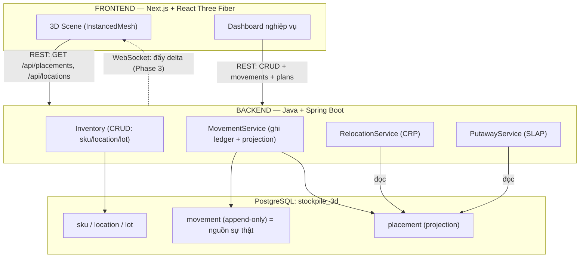
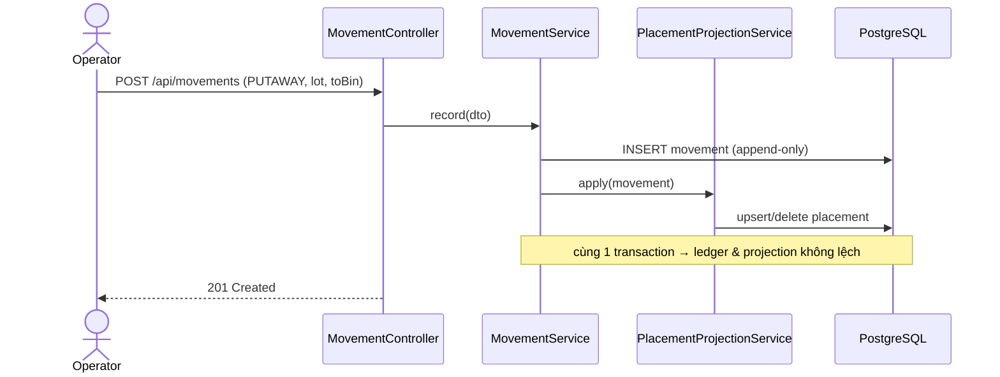

# Kiến trúc hệ thống — Stockpile-3D

> Cái nhìn kỹ thuật toàn cảnh: tầng, luồng dữ liệu, NFR (yêu cầu phi chức năng), và **API reference**. Bổ sung cho [01-overview.md](./01-overview.md) (định hướng) bằng chi tiết triển khai thực tế. Quyết định lớn: [adr/](./adr/).

---

## 📖 Nói nôm na (đọc cái này trước)

Phần mềm chia làm **3 tầng**, hình dung như một **nhà hàng**:

| Tầng | Như bộ phận nào trong nhà hàng | Làm gì | Công nghệ |
|---|---|---|---|
| **Frontend** (giao diện) | **Phòng ăn + phục vụ** — chỗ khách nhìn thấy | Hiển thị kho 3D, nhận thao tác người dùng | Next.js + React Three Fiber (vẽ 3D) |
| **Backend** (xử lý) | **Bếp** — nơi nấu, khách không thấy | Tính toán (CRP/SLAP), xử lý nghiệp vụ, ghi sổ | Java + Spring Boot |
| **Database** (kho dữ liệu) | **Kho thực phẩm + sổ sách** | Lưu trữ tất cả dữ liệu lâu dài | PostgreSQL |

Cách chúng nói chuyện:
- Frontend hỏi Backend qua **REST** (như phục vụ ghi order đưa xuống bếp): "cho tôi danh sách vị trí", "gợi ý chỗ cất kiện này".
- Backend lưu/đọc từ **Database** (bếp lấy đồ từ kho).
- Sau này (Phase 3) Backend sẽ **chủ động báo** Frontend khi có thay đổi, qua **WebSocket** (như bếp bấm chuông gọi phục vụ ra lấy món) — thay vì Frontend phải hỏi đi hỏi lại.

Vài từ trong code (giải thích nhanh):
- **Controller:** cửa tiếp nhận request (như nhân viên nhận order).
- **Service:** nơi chứa logic xử lý (như đầu bếp).
- **Repository:** nơi đọc/ghi database (như người ra kho lấy đồ).
- **API / endpoint:** một "địa chỉ" mà Frontend gọi để lấy/gửi dữ liệu, vd `GET /api/placements`.

> Phần dưới là chi tiết kỹ thuật: sơ đồ luồng, danh sách API, yêu cầu hiệu năng.

## 1. Ba tầng

**Stack:** xem [ADR-0002](./adr/0002-backend-spring-boot.md) (Spring Boot) — Spring Web (REST) + Spring Data JPA/Hibernate + Flyway + springdoc-openapi; frontend Next.js + R3F + Three.js; data PostgreSQL.

## 2. Luồng dữ liệu chính

### 2.1. Ghi một thay đổi vật lý (write path)

### 2.2. Đọc trạng thái để render (read path)
Frontend gọi `GET /api/locations` (khung kệ) + `GET /api/placements` (lô đang đặt) → render bằng `InstancedMesh`. Đọc thẳng từ `placement` (projection) — nhanh, không phải replay ledger mỗi lần.

### 2.3. Đề xuất (decision path)
`GET /api/relocation-plan` (CRP) và `GET /api/putaway-suggestion` (SLAP) **chỉ đọc** projection + master, trả đề xuất. **Không** ghi gì — đúng invariant "engine đề xuất, người xác nhận".

## 3. Invariant kiến trúc (không vi phạm nếu chưa có ADR mới)

1. **Ledger append-only là nguồn sự thật**; `placement` là projection ([ADR-0003](./adr/0003-ledger-projection.md)).
2. **Blocking cục bộ theo lane** — không spatial index toàn cục/PostGIS ở v1 ([ADR-0002](./adr/0002-backend-spring-boot.md) bối cảnh; [01-overview §6](./01-overview.md)).
3. **3D không ra quyết định** — chỉ trình bày + xác nhận.
4. **on-top dùng `>=`** + overlap (x,y) ([algorithm-spec §3](./algorithm-spec.md), [dev-log](./dev-log.md)).

## 4. NFR — yêu cầu phi chức năng (mục tiêu định lượng)

| Hạng mục | Mục tiêu | Hiện trạng |
|---|---|---|
| Quy mô | 10k–50k vị trí, ~5k–20k lô active | data model + index theo lane sẵn sàng |
| CRP cho 1 lane | < 500 ms (lane ≤ 100 lô) | đạt — `O(n²)`, n nhỏ ([spec §5](./algorithm-spec.md)) |
| Render 3D | ~60 fps tới ~50k instance | InstancedMesh + frustum culling |
| Độ trễ sync | < 1 s scan → cập nhật scene | Phase 3 (WebSocket) |
| Nhất quán | ledger trọng tài; optimistic lock trên `bin` | ledger ✓; lock Phase 3 |

## 5. API reference (hiện có)

Base URL: `http://localhost:8080`. Tài liệu sống: `/swagger-ui.html` (springdoc). Tất cả body JSON.

### Inventory — master data (CRUD đầy đủ)
| Method | Path | Mô tả | Lỗi |
|---|---|---|---|
| GET | `/api/skus` · `/api/skus/{id}` | liệt kê / xem SKU | 404 |
| POST | `/api/skus` | tạo SKU | 400 (validation) |
| PUT | `/api/skus/{id}` | sửa | 404, 400 |
| DELETE | `/api/skus/{id}` | xóa | 404 |
| ... | `/api/locations`, `/api/lots` | tương tự (lot tham chiếu `skuId`) | 404, 400 |

### Trạng thái & ledger
| Method | Path | Mô tả |
|---|---|---|
| GET | `/api/placements` | trạng thái hiện tại (read-only projection — cho 3D) |
| POST | `/api/movements` | ghi 1 bút toán (append-only) → cập nhật placement |

### Engine (chỉ đọc, đề xuất)
| Method | Path | Mô tả | Lỗi |
|---|---|---|---|
| GET | `/api/relocation-plan?lotId={id}` | CRP: chuỗi bước dời để lấy lô | 404 (không có lô/placement), 400 (hết vị trí tạm) |
| GET | `/api/putaway-suggestion?lotId={id}` | SLAP: vị trí cất tốt nhất + ứng viên xếp hạng | 404 |

### Hạ tầng
| Method | Path | Mô tả |
|---|---|---|
| GET | `/api/health` | health app-owned → `{"status":"UP"}` |
| GET | `/actuator/health` | health Actuator |
| GET | `/v3/api-docs` · `/swagger-ui.html` | OpenAPI + Swagger UI |

## 6. Quyết định bảo mật / cấu hình

- **Không hardcode secret** — DB credentials đọc từ biến môi trường (`DATABASE_URL`, `DB_USER`, `DB_PASSWORD`); `.env.local` gitignored.
- **CORS** — chỉ cho phép origin frontend (mặc định `localhost:3000`), cấu hình qua `app.cors.allowed-origins`.
- **Trọng số SLAP** cấu hình qua `app.putaway.*` (không cứng trong code).
- **Migration** versioned bằng Flyway; `ddl-auto=validate` (Hibernate chỉ kiểm, không tự đổi schema).

## 7. Triển khai (deploy)

`docker compose up --build` dựng cả postgres + backend + frontend ([docker-compose.yml](../docker-compose.yml)). Backend multi-stage build (temurin 25), frontend (node 22). Chi tiết: [README](../README.md).

## 8. Lộ trình kiến trúc (phía trước)

- **Phase 3 — realtime:** Spring WebSocket đẩy delta `placement` tới 3D scene khi có movement; optimistic lock trên `bin` chống 2 putaway cùng chỗ.
- **Phase 4 — phân tích & mở rộng:** heatmap, báo cáo, what-if; xem lại spatial index khi multi-warehouse.
