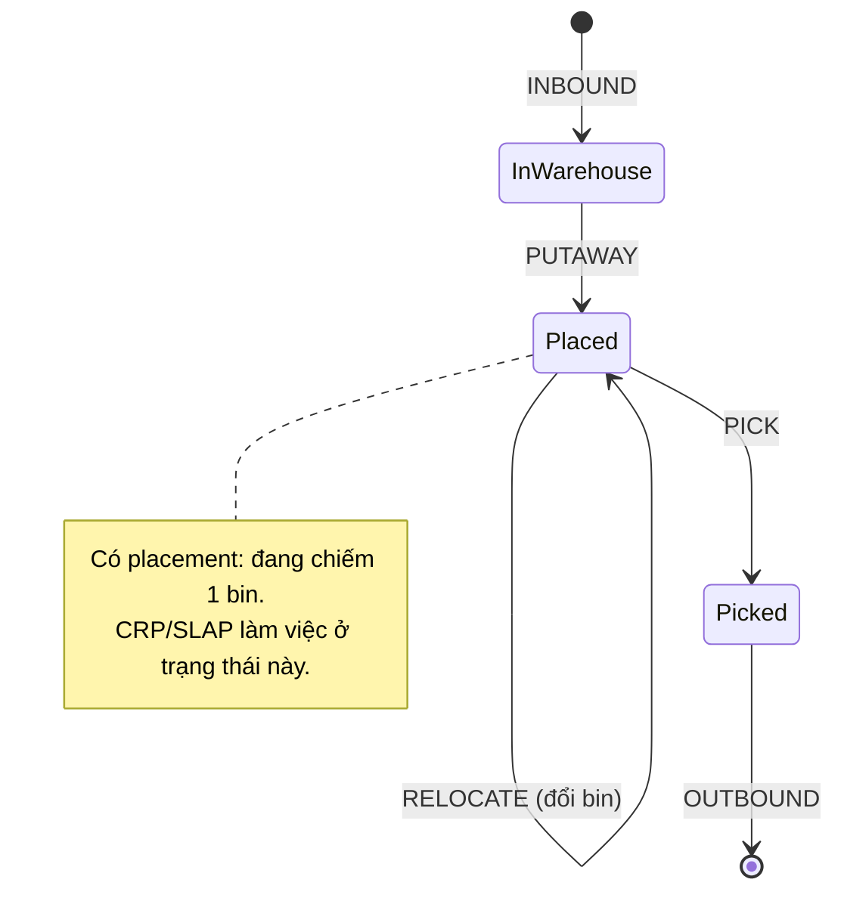

# Nghiệp vụ kho — Stockpile-3D

> Giải thích **nghiệp vụ vận hành kho** (warehouse operations) mà hệ thống hỗ trợ: các quy trình, vai trò, vòng đời dữ liệu. Đọc cùng [01-overview.md](./01-overview.md) (định vị sản phẩm) và [data-model.md](./data-model.md) (cấu trúc dữ liệu). Thuật ngữ: [glossary.md](./glossary.md).

## 1. Bối cảnh: kho block-stacking

**Block-stacking** (xếp khối / xếp chồng) = hàng được xếp chồng lên nhau và xếp sâu vào trong, **không phải** mỗi vị trí một kệ riêng. Tiết kiệm diện tích nhưng sinh vấn đề: **muốn lấy lô ở dưới/ở trong phải dời các lô đè/chắn trước nó**. Đây chính là nỗi đau mà 2 thuật toán lõi (CRP, SLAP) giải.

Đối lập với kho **selective racking** (kệ chọn-lựa, mỗi pallet một ô riêng, lấy ô nào cũng được ngay) — loại đó không cần CRP.

## 2. Vai trò người dùng

| Vai trò | Quan tâm | Hệ thống hỗ trợ gì |
|---|---|---|
| **Thủ kho / nhân viên vận hành** (operator) | Cất/lấy hàng nhanh, đúng | Gợi ý vị trí cất (SLAP), chuỗi bước dời để lấy hàng (CRP), xem kho 3D |
| **Quản lý kho** (warehouse manager) | Tối ưu không gian, giảm thao tác thừa | Heatmap mật độ, báo cáo (Phase 4) |
| **Hệ thống/tự động** | Ghi nhận mọi thay đổi vật lý | Ledger append-only, đồng bộ realtime (Phase 3) |

> **Nguyên tắc xuyên suốt:** hệ thống **đề xuất**, con người **xác nhận**. Engine tính toán; lớp 3D trình bày; người dùng bấm xác nhận. 3D không tự ý di chuyển hàng.

## 3. Năm loại nghiệp vụ (= 5 loại movement)

Mọi thay đổi vật lý của kho đều là một trong 5 loại, và đều ghi vào **movement ledger** (sổ cái — xem [ADR-0003](./adr/0003-ledger-projection.md)):

| Loại (MovementType) | Nghĩa nghiệp vụ | from_bin | to_bin | Tác động lên `placement` |
|---|---|---|---|---|
| **INBOUND** | Hàng vào kho (nhận từ nhà cung cấp) | — | bin đích (hoặc staging) | tạo placement (nếu có bin) |
| **PUTAWAY** | Cất hàng vào vị trí lưu trữ | (staging) | bin lưu trữ | đặt/đổi placement tại to_bin |
| **RELOCATE** | Dời hàng từ vị trí này sang vị trí khác (vd để giải phóng lô bị chặn — bước của CRP) | bin cũ | bin mới | đổi bin của placement |
| **PICK** | Lấy hàng ra (chuẩn bị xuất) | bin | — | xóa placement |
| **OUTBOUND** | Hàng rời kho (giao đi) | — | — | xóa placement |

## 4. Vòng đời một lô (lot lifecycle)

- **InWarehouse:** lô đã vào kho nhưng có thể chưa cất (ở khu staging — chưa có placement, hoặc placement ở bin tạm).
- **Placed:** lô đang ở một bin lưu trữ (có `placement`). Đây là lúc nó có thể *chặn* lô khác hoặc *bị chặn*.
- **Picked → OUTBOUND:** lô rời vị trí rồi rời kho. Lịch sử vẫn còn nguyên trong ledger (audit được).

## 5. Hai bài toán lõi gắn với nghiệp vụ

### 5.1. Lúc CẤT hàng → SLAP (Putaway Engine)
Khi có lô mới cần cất, câu hỏi nghiệp vụ: **"cất vào đâu cho tối ưu?"**. Cất ẩu tạo "nợ vận hành tương lai" (sau này lấy ra tốn công dời). SLAP chấm điểm các vị trí trống (gần dock, ít gây chặn, hợp FEFO, vừa kích thước) và gợi ý chỗ tốt nhất. Chi tiết: [algorithm-spec.md §9](./algorithm-spec.md).

### 5.2. Lúc LẤY hàng → CRP (Relocation Engine)
Khi cần lấy một lô bị đè/chắn, câu hỏi: **"phải dời những lô nào, theo thứ tự nào?"**. CRP tính chuỗi bước dời tối thiểu. Output là danh sách bước → hiển thị thành animation 3D để operator làm theo. Chi tiết: [algorithm-spec.md §1–8](./algorithm-spec.md).

## 6. FIFO / FEFO — kỷ luật xuất hàng

- **FIFO** (First-In First-Out — nhập trước xuất trước): lô vào kho trước thì nên xuất trước. Hợp với hàng không hạn dùng.
- **FEFO** (First-Expired First-Out — hết hạn trước xuất trước): lô **hết hạn sớm** phải xuất trước, bất kể vào lúc nào. Bắt buộc cho hàng có `expiry` (thực phẩm, dược).
- Mỗi `Sku` khai báo `handling` = FIFO hoặc FEFO. SLAP dùng tín hiệu này: lô FEFO/có expiry → ưu tiên đặt **vị trí dễ lấy** (z thấp) để khi tới hạn lấy ra không phải dời nhiều.

## 7. Ground-truth: vì sao ledger là nguồn sự thật

Rủi ro lớn nhất của WMS là **lệch giữa hệ thống và thực tế** (system nói lô ở A, thực tế ở B). Stockpile-3D chống lệch bằng:
- **Mọi điểm chạm vật lý đều scan + ghi movement** (append-only, không sửa lịch sử).
- **`placement` (trạng thái hiện tại) là projection** dựng lại từ ledger — khi nghi ngờ, chạy `rebuildAll()` để dựng lại từ sự thật.
- Đây là nền cho **cycle counting** (kiểm kê cuốn chiếu) tương lai: so thực tế scan vs projection để phát hiện lệch sớm.

Chi tiết kỹ thuật: [ADR-0003](./adr/0003-ledger-projection.md), [architecture.md](./architecture.md).
