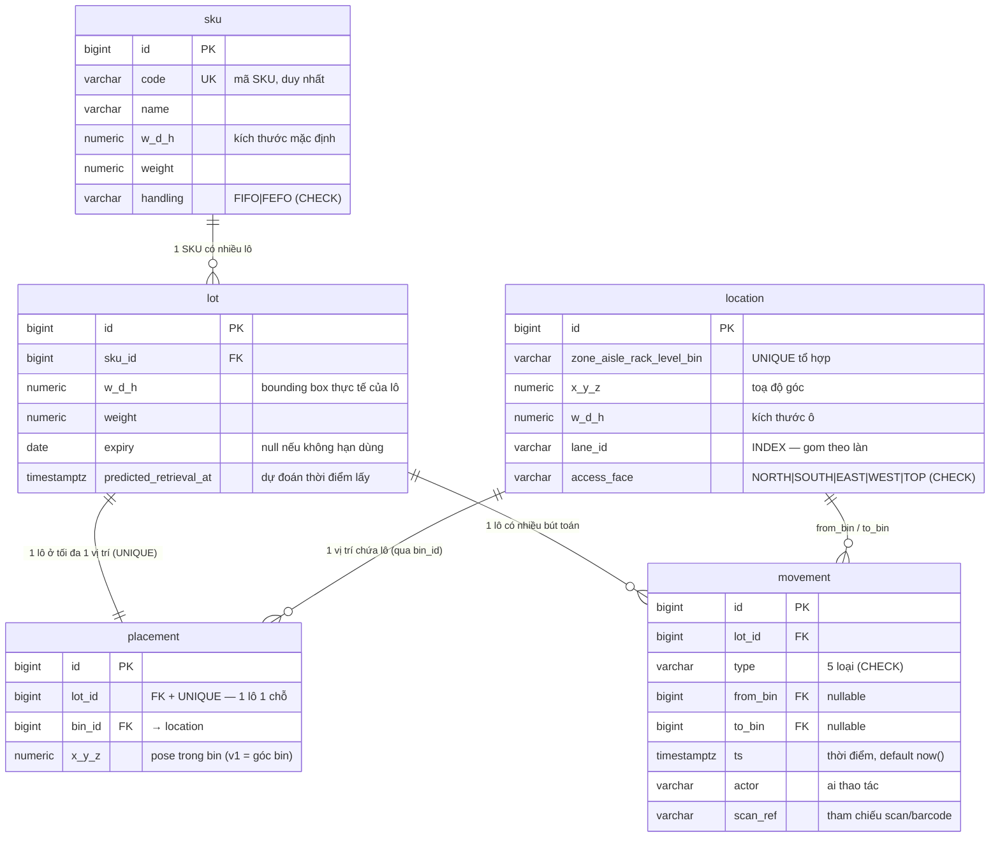

# Data model — Stockpile-3D

> Mô tả chi tiết schema PostgreSQL (5 bảng, Flyway `V1`), từng cột + ràng buộc + **lý do thiết kế**. Nguồn code: [V1__core_schema.sql](../src/backend/src/main/resources/db/migration/V1__core_schema.sql) và entities trong `src/backend/.../inventory/domain/`. Tổng quan: [01-overview.md §6](./01-overview.md). Nghiệp vụ: [business.md](./business.md).

---

## 📖 Nói nôm na (đọc cái này trước)

"Data model" = **cách phần mềm lưu thông tin trong database, dưới dạng các bảng** (giống các sheet trong Excel: mỗi bảng có nhiều cột, mỗi dòng là một bản ghi).

Hệ thống có **5 bảng**, hãy hình dung như 5 cuốn sổ trong kho:

| Bảng | Nói nôm na là gì | Ví dụ một dòng |
|---|---|---|
| **sku** | Danh mục **loại sản phẩm** (như "menu") | "Sữa tươi TH, hộp 1L, hàng FEFO" |
| **location** | Danh sách **các ô chứa** trong kho (như sơ đồ chỗ ngồi) | "Ô Zone A - Kệ 3 - Tầng 2, ở tọa độ (5,3,2)" |
| **lot** | Một **kiện hàng cụ thể** đang/​sẽ ở trong kho | "Kiện sữa #1234, hết hạn 1/7/2026" |
| **placement** | Bảng "**hiện giờ kiện nào nằm ô nào**" | "Kiện #1234 đang ở ô Zone A-3-2" |
| **movement** | **Sổ nhật ký** mọi lần hàng di chuyển | "10h: cất kiện #1234 vào ô A-3-2" |

Quan hệ giữa chúng (đọc là "có"):
- Một **sku** *có nhiều* **lot** (một loại sữa có nhiều kiện).
- Một **lot** *nằm ở một* **location** (qua bảng **placement**).
- Mọi thay đổi *được ghi vào* **movement**.

Vài từ kỹ thuật sẽ gặp bên dưới, dịch nhanh:
- **PK** (primary key — khóa chính): cột số định danh duy nhất mỗi dòng (như số thứ tự).
- **FK** (foreign key — khóa ngoại): cột "trỏ tới" dòng ở bảng khác (như "kiện này thuộc loại sữa nào").
- **UNIQUE**: không cho trùng (vd một kiện không thể ở 2 ô cùng lúc).
- **index**: "mục lục" giúp tìm nhanh (như mục lục sách).

> Phần dưới là chi tiết từng cột + lý do thiết kế. Người mới có thể đọc lướt bảng tóm tắt trên là đủ.

---

## Nguyên tắc thiết kế chung

- **Khóa chính `BIGINT GENERATED ALWAYS AS IDENTITY`** (số tự tăng) — nhẹ, index nhanh, join rẻ. Đủ cho single-warehouse; nếu sau cần multi-warehouse/sync thì cân nhắc UUID (ghi [ADR-0002](./adr/0002-backend-spring-boot.md) bối cảnh).
- **Enum lưu `VARCHAR` + `CHECK constraint`** (không dùng Postgres enum type) — dễ thêm giá trị, map thẳng JPA `@Enumerated(STRING)`, tránh migration phức tạp khi đổi enum.
- **Tọa độ & kích thước = `NUMERIC(12,3)` rời** (x,y,z,w,d,h) — minh bạch, truy vấn blocking đọc trực tiếp từng trục. Không gói thành kiểu phức hợp.
- **`movement` append-only** — chỉ INSERT, không UPDATE/DELETE (enforce ở tầng app); là nguồn sự thật. `placement` là projection ([ADR-0003](./adr/0003-ledger-projection.md)).

## Tổng quan quan hệ (ERD)

## Chi tiết từng bảng

### `sku` — master sản phẩm
| Cột | Kiểu | Ràng buộc | Ý nghĩa |
|---|---|---|---|
| id | BIGINT | PK identity | khóa |
| code | VARCHAR(64) | **UNIQUE** | mã SKU người dùng nhập |
| name | VARCHAR(255) | NOT NULL | tên |
| w, d, h | NUMERIC(12,3) | NOT NULL | kích thước mặc định (rộng/sâu/cao) |
| weight | NUMERIC(12,3) | NOT NULL | khối lượng |
| handling | VARCHAR(8) | CHECK in (FIFO,FEFO) | kỷ luật xuất hàng |

**Vì sao:** SKU là "loại sản phẩm"; nhiều `lot` cùng một SKU. `handling` ở cấp SKU vì cùng loại hàng thì cùng kỷ luật xuất.

### `location` — khung không gian kho
| Cột | Kiểu | Ràng buộc | Ý nghĩa |
|---|---|---|---|
| id | BIGINT | PK | khóa |
| zone, aisle, rack, level, bin | VARCHAR(64) | **UNIQUE tổ hợp** | địa chỉ phân cấp (zone→aisle→rack→level→bin) |
| x, y, z | NUMERIC(12,3) | NOT NULL | toạ độ **góc** của ô (để render 3D + tính blocking) |
| w, d, h | NUMERIC(12,3) | NOT NULL | kích thước ô |
| lane_id | VARCHAR(64) | NOT NULL, **INDEX** | định danh làn — blocking chỉ xét trong cùng lane |
| access_face | VARCHAR(16) | CHECK | mặt lấy hàng (hướng rút) |

**Index:** `location(lane_id)` và `location(zone,aisle,rack)` — phục vụ truy vấn blocking *cục bộ theo lane* (không cần spatial index toàn cục, xem [ADR-0002](./adr/0002-backend-spring-boot.md)).

**Vì sao tách x/y/z + w/d/h:** blocking cần đọc biên từng trục (`zMin = z`, `zMax = z+h`...). Lưu rời = đọc thẳng, không phải parse.

### `lot` — đơn vị vật lý trong kho
| Cột | Kiểu | Ràng buộc | Ý nghĩa |
|---|---|---|---|
| id | BIGINT | PK | khóa |
| sku_id | BIGINT | **FK → sku** | thuộc SKU nào |
| w, d, h | NUMERIC(12,3) | NOT NULL | bounding box **thực tế** của lô (có thể khác kích thước SKU mặc định) |
| weight | NUMERIC(12,3) | NOT NULL | khối lượng |
| expiry | DATE | nullable | hạn dùng (null = không hạn) → tín hiệu FEFO |
| predicted_retrieval_at | TIMESTAMPTZ | nullable | dự đoán thời điểm sẽ lấy → CRP dùng để ưu tiên dời lô lấy muộn |

**Vì sao `lot.w/d/h` riêng dù SKU đã có:** một lô cụ thể có thể đóng gói khác kích thước chuẩn; thuật toán dùng kích thước *thực* của lô.

### `placement` — lô đang ở đâu (projection)
| Cột | Kiểu | Ràng buộc | Ý nghĩa |
|---|---|---|---|
| id | BIGINT | PK | khóa |
| lot_id | BIGINT | FK → lot, **UNIQUE** | lô nào (1 lô chỉ 1 vị trí) |
| bin_id | BIGINT | FK → location | đang ở ô nào |
| x, y, z | NUMERIC(12,3) | NOT NULL | pose của lô trong ô (v1 = góc bin) |

**Ràng buộc then chốt:** `lot_id UNIQUE` — một lô không thể ở 2 nơi cùng lúc. **Đây là bảng dẫn xuất** — không sửa trực tiếp ngoài `PlacementProjectionService`; nếu sửa tay sẽ lệch ledger.

### `movement` — sổ cái vật lý (append-only)
| Cột | Kiểu | Ràng buộc | Ý nghĩa |
|---|---|---|---|
| id | BIGINT | PK | khóa |
| lot_id | BIGINT | FK → lot | lô nào |
| type | VARCHAR(16) | CHECK (5 loại) | INBOUND/PUTAWAY/RELOCATE/PICK/OUTBOUND |
| from_bin | BIGINT | FK → location, nullable | từ ô (null nếu vào kho/staging) |
| to_bin | BIGINT | FK → location, nullable | tới ô (null nếu rời kho) |
| ts | TIMESTAMPTZ | NOT NULL default now() | thời điểm |
| actor | VARCHAR(128) | nullable | ai thao tác |
| scan_ref | VARCHAR(128) | nullable | tham chiếu scan/barcode |

**Index:** `movement(lot_id, ts)` — phục vụ **replay** (đọc lịch sử 1 lô theo thứ tự thời gian) và dựng lại projection.

**Vì sao from/to nullable:** INBOUND không có `from` (hàng từ ngoài); OUTBOUND không có `to` (hàng rời kho). Quy tắc chuyển trạng thái theo từng loại: xem [business.md §3](./business.md) và `PlacementProjectionService.apply`.

## Vòng đời dữ liệu (tóm tắt)

1. Tạo `sku` → tạo `lot` (gắn sku) → có lô "trên giấy".
2. Ghi `movement` (PUTAWAY tới một `location`) → `PlacementProjectionService` tạo/cập nhật `placement`.
3. RELOCATE/PICK/OUTBOUND → cập nhật/xóa `placement`, ledger vẫn giữ lịch sử.
4. Bất kỳ lúc nào: `rebuildAll()` dựng lại toàn bộ `placement` từ `movement` (theo `ts`) — kiểm tra nhất quán.

> Toàn bộ quy tắc chuyển trạng thái + ví dụ: [business.md](./business.md) · [ADR-0003](./adr/0003-ledger-projection.md).
