# Sơ đồ thiết kế — Stockpile-3D

> Sơ đồ trực quan (Mermaid — xem trực tiếp trên GitHub) cho **toàn bộ nghiệp vụ** hiện có: data model, kiến trúc, 2 thuật toán lõi (CRP/SLAP), và các slice sau roadmap (multi-warehouse, picking, cross-warehouse transfer, scan enforcement, what-if, realtime, reporting). Phần class/ERD/component có thêm mô hình Astah ở [`diagrams/stockpile-3d.asta`](./diagrams/stockpile-3d.asta) (mở bằng Astah để chỉnh/export ảnh).
>
> **Mục lục:**
> - **Cấu trúc:** §1 Class domain (đầy đủ) · §2 ERD gọn · §3 Class service (engine) · §4 Component/kiến trúc
> - **Use case:** §5 Use case tổng thể (theo actor)
> - **Vòng đời (State):** §6 Lô (lot) · §7 Đơn lấy hàng (pick order) · §8 Chuyển kho (transfer)
> - **Activity:** §9 Ghi movement + cập nhật projection
> - **Sequence:** §10 Putaway/SLAP · §11 CRP (đề xuất→xác nhận) · §12 Picking (order→pick-list) · §13 Cross-warehouse transfer · §14 Scan enforcement · §15 Realtime (STOMP delta)
> - **Thuật toán (Flowchart):** §16 CRP · §17 SLAP
> - **Tham chiếu:** §18 ERD đầy đủ cột (Flyway V1–V6)
>
> Nguồn sự thật về thiết kế: [01-overview.md](./01-overview.md) §6, [data-model.md](./data-model.md), [algorithm-spec.md](./algorithm-spec.md), [architecture.md](./architecture.md) và các [ADR](./adr/).

---

## 1. Class diagram — Domain (đầy đủ entity)

Phản ánh entity trong `src/backend/.../*/domain`. `placement` là projection từ
ledger; `movement` là ledger **append-only** (xem [ADR-0003](./adr/0003-ledger-projection.md)).
`warehouse` là ranh giới đa kho (ADR-0009): mọi `location`, `movement`,
`pick_order` thuộc đúng một kho. `transfer` (ADR-0010) là cầu nối hai kho, liên
kết hai `movement` đơn-kho (OUTBOUND ở A + INBOUND ở B).

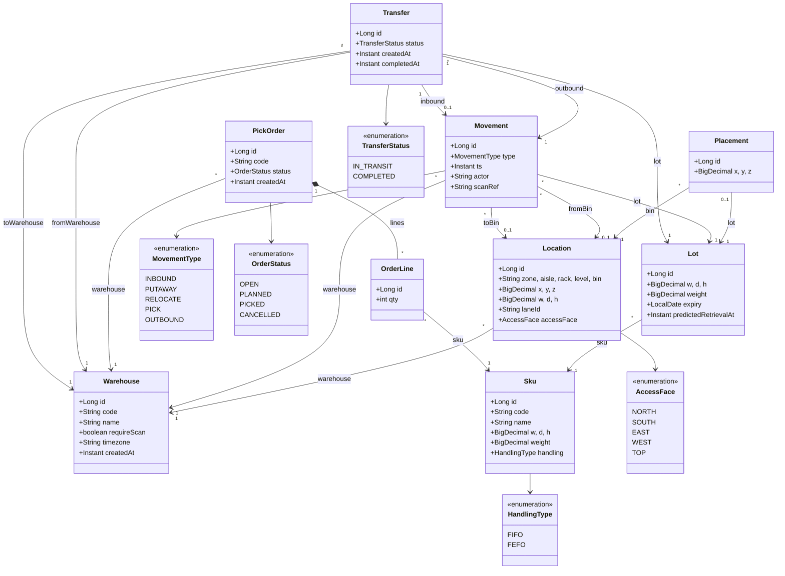
```mermaid
classDiagram
    class Warehouse {
        +Long id
        +String code
        +String name
        +boolean requireScan
        +String timezone
        +Instant createdAt
    }
    class Location {
        +Long id
        +String zone, aisle, rack, level, bin
        +BigDecimal x, y, z
        +BigDecimal w, d, h
        +String laneId
        +AccessFace accessFace
    }
    class Sku {
        +Long id
        +String code
        +String name
        +BigDecimal w, d, h
        +BigDecimal weight
        +HandlingType handling
    }
    class Lot {
        +Long id
        +BigDecimal w, d, h
        +BigDecimal weight
        +LocalDate expiry
        +Instant predictedRetrievalAt
    }
    class Placement {
        +Long id
        +BigDecimal x, y, z
    }
    class Movement {
        +Long id
        +MovementType type
        +Instant ts
        +String actor
        +String scanRef
    }
    class PickOrder {
        +Long id
        +String code
        +OrderStatus status
        +Instant createdAt
    }
    class OrderLine {
        +Long id
        +int qty
    }
    class Transfer {
        +Long id
        +TransferStatus status
        +Instant createdAt
        +Instant completedAt
    }

    class HandlingType {
        <<enumeration>>
        FIFO
        FEFO
    }
    class AccessFace {
        <<enumeration>>
        NORTH
        SOUTH
        EAST
        WEST
        TOP
    }
    class MovementType {
        <<enumeration>>
        INBOUND
        PUTAWAY
        RELOCATE
        PICK
        OUTBOUND
    }
    class OrderStatus {
        <<enumeration>>
        OPEN
        PLANNED
        PICKED
        CANCELLED
    }
    class TransferStatus {
        <<enumeration>>
        IN_TRANSIT
        COMPLETED
    }

    Location "*" --> "1" Warehouse : warehouse
    Lot "*" --> "1" Sku : sku
    Placement "0..1" --> "1" Lot : lot
    Placement "*" --> "1" Location : bin
    Movement "*" --> "1" Lot : lot
    Movement "*" --> "1" Warehouse : warehouse
    Movement "*" --> "0..1" Location : fromBin
    Movement "*" --> "0..1" Location : toBin
    PickOrder "*" --> "1" Warehouse : warehouse
    PickOrder "1" *-- "*" OrderLine : lines
    OrderLine "*" --> "1" Sku : sku
    Transfer "*" --> "1" Lot : lot
    Transfer "*" --> "1" Warehouse : fromWarehouse
    Transfer "*" --> "1" Warehouse : toWarehouse
    Transfer "1" --> "1" Movement : outbound
    Transfer "1" --> "0..1" Movement : inbound
    Sku --> HandlingType
    Location --> AccessFace
    Movement --> MovementType
    PickOrder --> OrderStatus
    Transfer --> TransferStatus
```

## 2. ERD — bảng PostgreSQL (gọn)

Khóa chính BIGINT identity; enum lưu VARCHAR + CHECK. `placement.lot_id` UNIQUE
(một lô chiếm tối đa một vị trí). Bin code **unique theo từng kho** (ADR-0009).
Xem §18 cho ERD đầy đủ cột + Flyway.

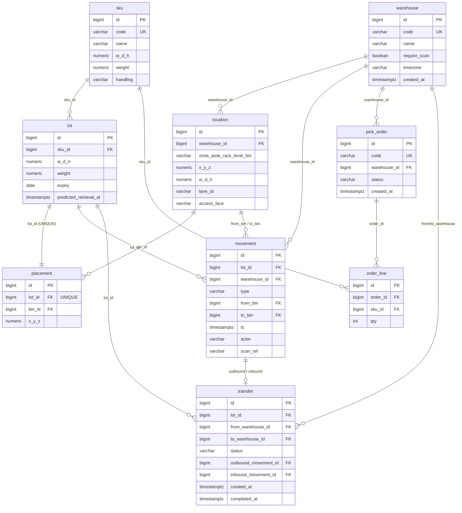
```mermaid
erDiagram
    warehouse ||--o{ location   : "warehouse_id"
    warehouse ||--o{ movement   : "warehouse_id"
    warehouse ||--o{ pick_order : "warehouse_id"
    location  ||--o{ placement  : "bin_id"
    location  ||--o{ movement   : "from_bin / to_bin"
    sku       ||--o{ lot        : "sku_id"
    sku       ||--o{ order_line : "sku_id"
    lot       ||--|| placement  : "lot_id (UNIQUE)"
    lot       ||--o{ movement   : "lot_id"
    lot       ||--o{ transfer   : "lot_id"
    pick_order ||--o{ order_line : "order_id"
    warehouse ||--o{ transfer   : "from/to_warehouse"
    movement  ||--o| transfer   : "outbound / inbound"

    warehouse {
        bigint id PK
        varchar code UK
        varchar name
        boolean require_scan
        varchar timezone
        timestamptz created_at
    }
    location {
        bigint id PK
        bigint warehouse_id FK
        varchar zone_aisle_rack_level_bin
        numeric x_y_z
        numeric w_d_h
        varchar lane_id
        varchar access_face
    }
    sku {
        bigint id PK
        varchar code UK
        varchar name
        numeric w_d_h
        numeric weight
        varchar handling
    }
    lot {
        bigint id PK
        bigint sku_id FK
        numeric w_d_h
        numeric weight
        date expiry
        timestamptz predicted_retrieval_at
    }
    placement {
        bigint id PK
        bigint lot_id FK "UNIQUE"
        bigint bin_id FK
        numeric x_y_z
    }
    movement {
        bigint id PK
        bigint lot_id FK
        bigint warehouse_id FK
        varchar type
        bigint from_bin FK
        bigint to_bin FK
        timestamptz ts
        varchar actor
        varchar scan_ref
    }
    pick_order {
        bigint id PK
        varchar code UK
        bigint warehouse_id FK
        varchar status
        timestamptz created_at
    }
    order_line {
        bigint id PK
        bigint order_id FK
        bigint sku_id FK
        int qty
    }
    transfer {
        bigint id PK
        bigint lot_id FK
        bigint from_warehouse_id FK
        bigint to_warehouse_id FK
        varchar status
        bigint outbound_movement_id FK
        bigint inbound_movement_id FK
        timestamptz created_at
        timestamptz completed_at
    }
```

## 3. Class diagram — Service (engine & projection)

Mỗi engine tách một **lõi thuần** (không I/O, unit-test không cần DB) khỏi lớp
service điều phối I/O. Một quy tắc `apply()` dùng chung cho cả ghi incremental lẫn
`rebuildAll()` replay, nên hai con đường không thể lệch nhau (ADR-0003).

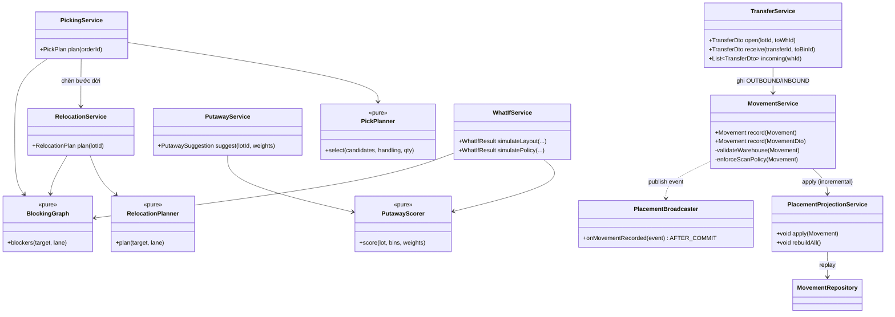
```mermaid
classDiagram
    class MovementService {
        +Movement record(Movement)
        +Movement record(MovementDto)
        -validateWarehouse(Movement)
        -enforceScanPolicy(Movement)
    }
    class PlacementProjectionService {
        +void apply(Movement)
        +void rebuildAll()
    }
    class RelocationService {
        +RelocationPlan plan(lotId)
    }
    class RelocationPlanner {
        <<pure>>
        +plan(target, lane)
    }
    class BlockingGraph {
        <<pure>>
        +blockers(target, lane)
    }
    class PutawayService {
        +PutawaySuggestion suggest(lotId, weights)
    }
    class PutawayScorer {
        <<pure>>
        +score(lot, bins, weights)
    }
    class PickingService {
        +PickPlan plan(orderId)
    }
    class PickPlanner {
        <<pure>>
        +select(candidates, handling, qty)
    }
    class TransferService {
        +TransferDto open(lotId, toWhId)
        +TransferDto receive(transferId, toBinId)
        +List~TransferDto~ incoming(whId)
    }
    class WhatIfService {
        +WhatIfResult simulateLayout(...)
        +WhatIfResult simulatePolicy(...)
    }
    class PlacementBroadcaster {
        +onMovementRecorded(event) AFTER_COMMIT
    }

    MovementService --> PlacementProjectionService : apply (incremental)
    MovementService ..> PlacementBroadcaster : publish event
    PlacementProjectionService --> MovementRepository : replay
    RelocationService --> RelocationPlanner
    RelocationService --> BlockingGraph
    PickingService --> PickPlanner
    PickingService --> RelocationService : chèn bước dời
    PickingService --> BlockingGraph
    PutawayService --> PutawayScorer
    TransferService --> MovementService : ghi OUTBOUND/INBOUND
    WhatIfService --> PutawayScorer
    WhatIfService --> BlockingGraph
```

## 4. Component / kiến trúc tổng thể

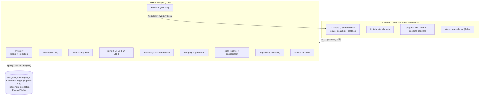
```mermaid
flowchart TB
    subgraph FE["Frontend — Next.js + React Three Fiber"]
        SCENE["3D scene (InstancedMesh)<br/>locate · scan box · heatmap"]
        PICKUI["Pick-list step-through"]
        REPORTS["/reports: KPI · what-if · incoming transfers"]
        WHSEL["Warehouse selector (?wh=)"]
    end

    subgraph BE["Backend — Spring Boot"]
        INV["Inventory<br/>(ledger + projection)"]
        SLAP["Putaway (SLAP)"]
        CRP["Relocation (CRP)"]
        PICK["Picking (FEFO/FIFO + CRP)"]
        XFER["Transfer (cross-warehouse)"]
        SETUP["Setup (grid generator)"]
        SCAN["Scan resolver + enforcement"]
        REP["Reporting (tz buckets)"]
        WHATIF["What-if simulator"]
        RT["Realtime (STOMP)"]
    end

    DB[("PostgreSQL: stockpile_3d<br/>movement ledger (append-only)<br/>+ placement (projection)<br/>Flyway V1–V6")]

    FE -- "REST (lệnh/truy vấn)" --> BE
    RT -- "WebSocket /ws (đẩy delta)" --> SCENE
    BE -- "Spring Data JPA + Flyway" --> DB
```

## 5. Use case — vai trò & chức năng (bao quát)

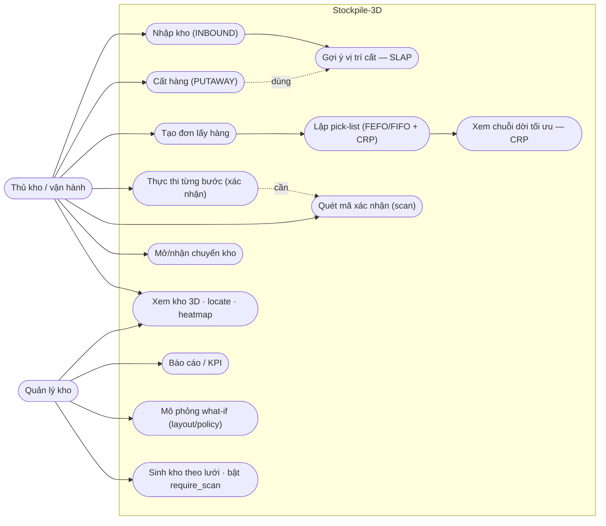
```mermaid
flowchart LR
    operator(["Thủ kho / vận hành"])
    manager(["Quản lý kho"])

    subgraph Stockpile-3D
        uc1(["Nhập kho (INBOUND)"])
        uc2(["Gợi ý vị trí cất — SLAP"])
        uc3(["Cất hàng (PUTAWAY)"])
        uc4(["Tạo đơn lấy hàng"])
        uc5(["Lập pick-list (FEFO/FIFO + CRP)"])
        uc6(["Xem chuỗi dời tối ưu — CRP"])
        uc7(["Thực thi từng bước (xác nhận)"])
        uc8(["Quét mã xác nhận (scan)"])
        uc9(["Mở/nhận chuyển kho"])
        uc10(["Xem kho 3D · locate · heatmap"])
        uc11(["Báo cáo / KPI"])
        uc12(["Mô phỏng what-if (layout/policy)"])
        uc13(["Sinh kho theo lưới · bật require_scan"])
    end

    operator --> uc1
    operator --> uc3
    operator --> uc4
    operator --> uc7
    operator --> uc8
    operator --> uc9
    operator --> uc10
    uc1 --> uc2
    uc3 -. dùng .-> uc2
    uc5 --> uc6
    uc4 --> uc5
    uc7 -. cần .-> uc8
    manager --> uc10
    manager --> uc11
    manager --> uc12
    manager --> uc13
```

## 6. State diagram — vòng đời một lô (lot lifecycle)

Lô đi qua các trạng thái theo loại movement. CRP/SLAP làm việc ở trạng thái
`Placed`. **In-transit** (đang chuyển kho) là cùng dạng "tồn tại nhưng chưa có
placement" với staging sau INBOUND (ADR-0010).

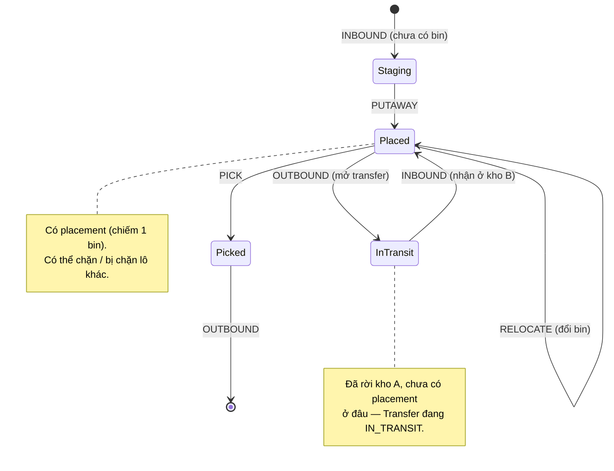
```mermaid
stateDiagram-v2
    [*] --> Staging: INBOUND (chưa có bin)
    Staging --> Placed: PUTAWAY
    Placed --> Placed: RELOCATE (đổi bin)
    Placed --> Picked: PICK
    Picked --> [*]: OUTBOUND
    Placed --> InTransit: OUTBOUND (mở transfer)
    InTransit --> Placed: INBOUND (nhận ở kho B)
    note right of Placed
        Có placement (chiếm 1 bin).
        Có thể chặn / bị chặn lô khác.
    end note
    note right of InTransit
        Đã rời kho A, chưa có placement
        ở đâu — Transfer đang IN_TRANSIT.
    end note
```

## 7. State diagram — vòng đời đơn lấy hàng (pick order)

Lập kế hoạch là **chỉ đề xuất** (không đổi trạng thái); thực thi là bước riêng.

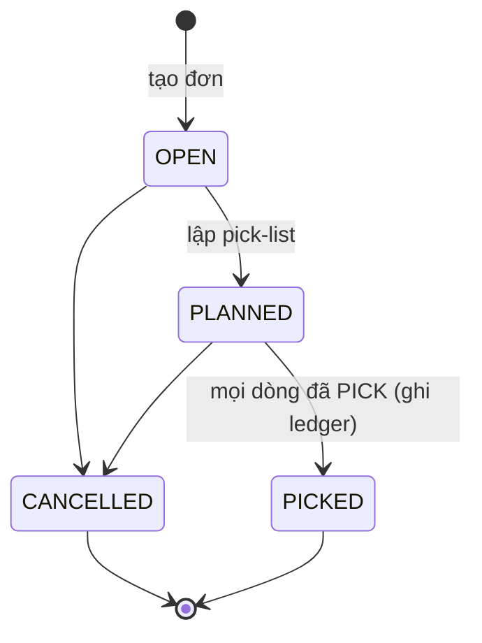
```mermaid
stateDiagram-v2
    [*] --> OPEN: tạo đơn
    OPEN --> PLANNED: lập pick-list
    PLANNED --> PICKED: mọi dòng đã PICK (ghi ledger)
    OPEN --> CANCELLED
    PLANNED --> CANCELLED
    CANCELLED --> [*]
    PICKED --> [*]
```

## 8. State diagram — vòng đời chuyển kho (transfer, ADR-0010)

Row `transfer` chỉ liên kết hai movement đơn-kho; v1 không có CANCELLED.

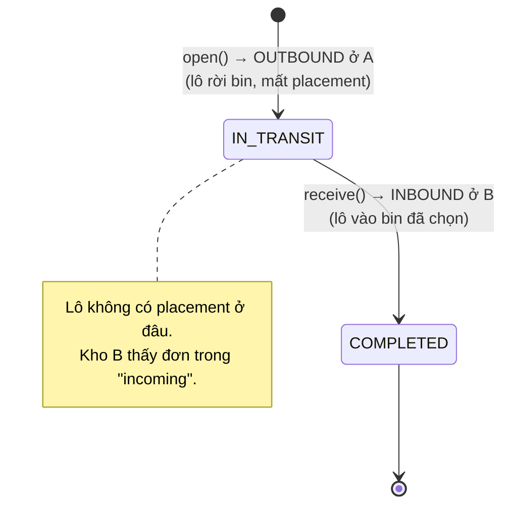
```mermaid
stateDiagram-v2
    [*] --> IN_TRANSIT: open() → OUTBOUND ở A<br/>(lô rời bin, mất placement)
    IN_TRANSIT --> COMPLETED: receive() → INBOUND ở B<br/>(lô vào bin đã chọn)
    COMPLETED --> [*]
    note right of IN_TRANSIT
        Lô không có placement ở đâu.
        Kho B thấy đơn trong "incoming".
    end note
```

## 9. Activity — ghi một movement + cập nhật projection

Điểm vào **duy nhất** cho mọi thay đổi vật lý: `MovementService.record`. Kiểm tra
đơn-kho + scan policy trước khi append ledger, rồi cập nhật projection và (sau
commit) đẩy delta realtime.

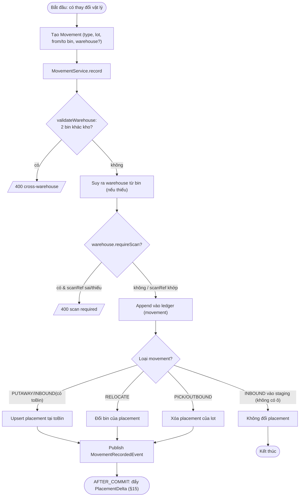
```mermaid
flowchart TD
    A(["Bắt đầu: có thay đổi vật lý"]) --> B["Tạo Movement (type, lot, from/to bin, warehouse?)"]
    B --> C["MovementService.record"]
    C --> V1{"validateWarehouse:<br/>2 bin khác kho?"}
    V1 -- có --> X1[/"400 cross-warehouse"/]
    V1 -- không --> V2["Suy ra warehouse từ bin (nếu thiếu)"]
    V2 --> S{"warehouse.requireScan?"}
    S -- có & scanRef sai/thiếu --> X2[/"400 scan required"/]
    S -- không / scanRef khớp --> D["Append vào ledger (movement)"]
    D --> E{"Loại movement?"}
    E -- PUTAWAY/INBOUND(có toBin) --> F["Upsert placement tại toBin"]
    E -- RELOCATE --> G["Đổi bin của placement"]
    E -- PICK/OUTBOUND --> H["Xóa placement của lot"]
    E -- "INBOUND vào staging (không có ô)" --> I0["Không đổi placement"]
    F --> P["Publish MovementRecordedEvent"]
    G --> P
    H --> P
    I0 --> Z(["Kết thúc"])
    P --> Z2(["AFTER_COMMIT: đẩy PlacementDelta (§15)"])
```

## 10. Sequence — Putaway (đề xuất SLAP → xác nhận → projection)

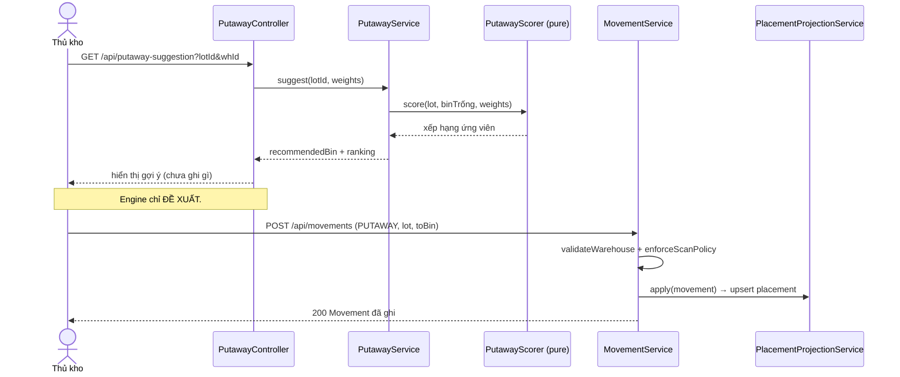
```mermaid
sequenceDiagram
    actor User as Thủ kho
    participant PC as PutawayController
    participant PSvc as PutawayService
    participant SC as PutawayScorer (pure)
    participant MS as MovementService
    participant PPS as PlacementProjectionService

    User->>PC: GET /api/putaway-suggestion?lotId&whId
    PC->>PSvc: suggest(lotId, weights)
    PSvc->>SC: score(lot, binTrống, weights)
    SC-->>PSvc: xếp hạng ứng viên
    PSvc-->>PC: recommendedBin + ranking
    PC-->>User: hiển thị gợi ý (chưa ghi gì)
    Note over User,PC: Engine chỉ ĐỀ XUẤT.
    User->>MS: POST /api/movements (PUTAWAY, lot, toBin)
    MS->>MS: validateWarehouse + enforceScanPolicy
    MS->>PPS: apply(movement) → upsert placement
    MS-->>User: 200 Movement đã ghi
```

## 11. Sequence — CRP: đề xuất rồi người dùng xác nhận

Tách bạch "đề xuất" (chỉ đọc) và "thực thi" (xác nhận → ghi ledger). Engine không
bao giờ tự quyết định.

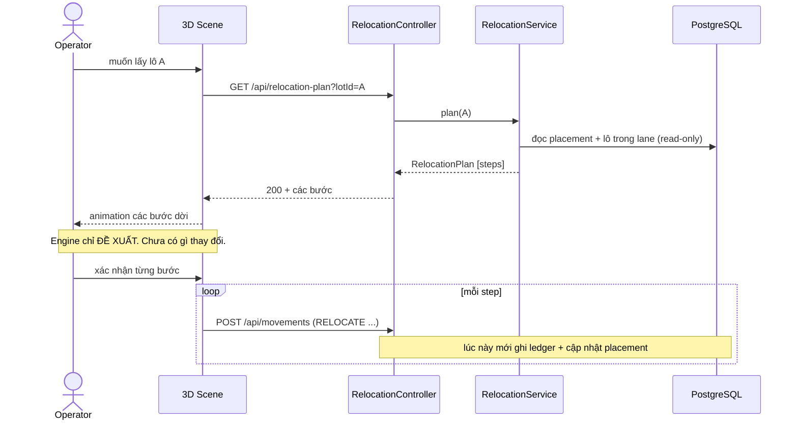
```mermaid
sequenceDiagram
    actor U as Operator
    participant FE as 3D Scene
    participant RC as RelocationController
    participant RS as RelocationService
    participant DB as PostgreSQL

    U->>FE: muốn lấy lô A
    FE->>RC: GET /api/relocation-plan?lotId=A
    RC->>RS: plan(A)
    RS->>DB: đọc placement + lô trong lane (read-only)
    RS-->>RC: RelocationPlan [steps]
    RC-->>FE: 200 + các bước
    FE-->>U: animation các bước dời
    Note over U,FE: Engine chỉ ĐỀ XUẤT. Chưa có gì thay đổi.
    U->>FE: xác nhận từng bước
    loop mỗi step
        FE->>RC: POST /api/movements (RELOCATE ...)
        Note over RC,DB: lúc này mới ghi ledger + cập nhật placement
    end
```

## 12. Sequence — Picking: đơn → pick-list (FEFO/FIFO + CRP)

Với mỗi dòng đơn, chọn lô (FEFO/FIFO, ưu tiên ít-bị-chặn); lô nào bị chặn thì
chèn trước các bước dời từ engine CRP. Chỉ đề xuất — không ghi ledger.

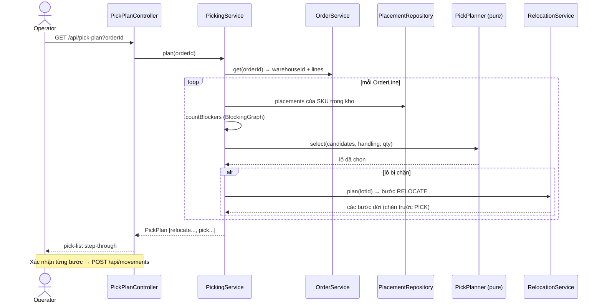
```mermaid
sequenceDiagram
    actor U as Operator
    participant PC as PickPlanController
    participant PS as PickingService
    participant OS as OrderService
    participant PR as PlacementRepository
    participant PP as PickPlanner (pure)
    participant RS as RelocationService

    U->>PC: GET /api/pick-plan?orderId
    PC->>PS: plan(orderId)
    PS->>OS: get(orderId) → warehouseId + lines
    loop mỗi OrderLine
        PS->>PR: placements của SKU trong kho
        PS->>PS: countBlockers (BlockingGraph)
        PS->>PP: select(candidates, handling, qty)
        PP-->>PS: lô đã chọn
        alt lô bị chặn
            PS->>RS: plan(lotId) → bước RELOCATE
            RS-->>PS: các bước dời (chèn trước PICK)
        end
    end
    PS-->>PC: PickPlan [relocate..., pick...]
    PC-->>U: pick-list step-through
    Note over U,PC: Xác nhận từng bước → POST /api/movements
```

## 13. Sequence — Cross-warehouse transfer (ADR-0010)

Chuyển lô A→B = **cặp movement đơn-kho** liên kết bởi row `transfer`: OUTBOUND ở A
khi mở, INBOUND ở B khi nhận. Mỗi movement vẫn đơn-kho nên luật "no cross-warehouse
movement" (ADR-0009) không bị vi phạm.

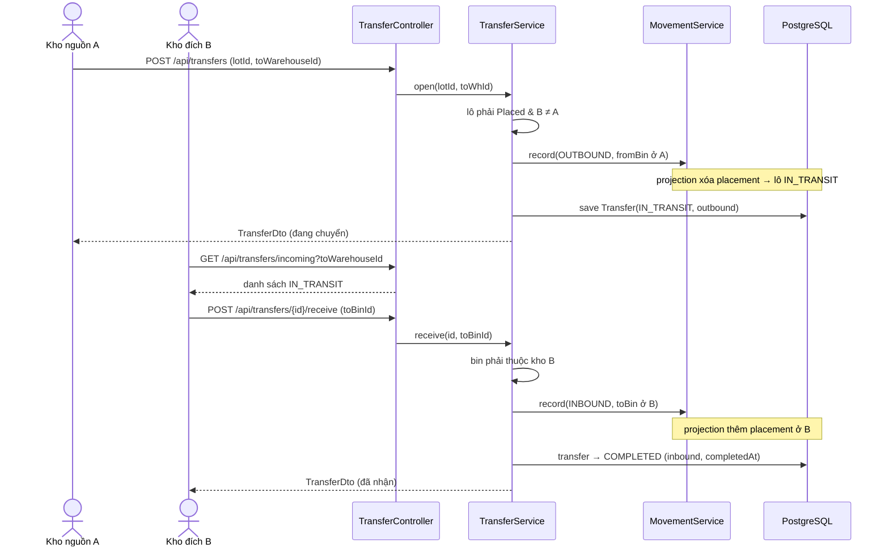
```mermaid
sequenceDiagram
    actor A as Kho nguồn A
    actor B as Kho đích B
    participant TC as TransferController
    participant TS as TransferService
    participant MS as MovementService
    participant DB as PostgreSQL

    A->>TC: POST /api/transfers (lotId, toWarehouseId)
    TC->>TS: open(lotId, toWhId)
    TS->>TS: lô phải Placed & B ≠ A
    TS->>MS: record(OUTBOUND, fromBin ở A)
    Note over MS,DB: projection xóa placement → lô IN_TRANSIT
    TS->>DB: save Transfer(IN_TRANSIT, outbound)
    TS-->>A: TransferDto (đang chuyển)

    B->>TC: GET /api/transfers/incoming?toWarehouseId
    TC-->>B: danh sách IN_TRANSIT
    B->>TC: POST /api/transfers/{id}/receive (toBinId)
    TC->>TS: receive(id, toBinId)
    TS->>TS: bin phải thuộc kho B
    TS->>MS: record(INBOUND, toBin ở B)
    Note over MS,DB: projection thêm placement ở B
    TS->>DB: transfer → COMPLETED (inbound, completedAt)
    TS-->>B: TransferDto (đã nhận)
```

## 14. Sequence — Scan enforcement (ADR-0007 follow-up)

Kho bật `require_scan` từ chối movement thiếu scanRef hoặc scanRef không phải mã
lô của chính movement (`LOT-{id}`). Kho tắt cờ giữ hợp đồng v1 "khuyến khích +
ghi nhận".

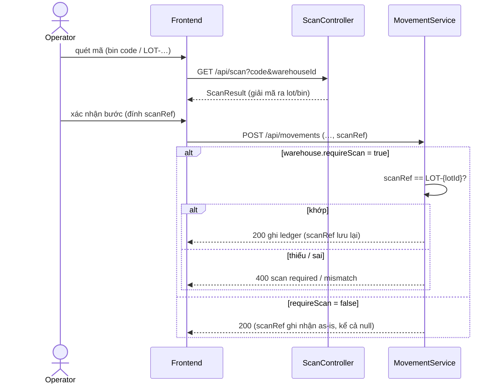
```mermaid
sequenceDiagram
    actor U as Operator
    participant FE as Frontend
    participant SC as ScanController
    participant MS as MovementService

    U->>FE: quét mã (bin code / LOT-…)
    FE->>SC: GET /api/scan?code&warehouseId
    SC-->>FE: ScanResult (giải mã ra lot/bin)
    U->>FE: xác nhận bước (đính scanRef)
    FE->>MS: POST /api/movements (…, scanRef)
    alt warehouse.requireScan = true
        MS->>MS: scanRef == LOT-{lotId}?
        alt khớp
            MS-->>FE: 200 ghi ledger (scanRef lưu lại)
        else thiếu / sai
            MS-->>FE: 400 scan required / mismatch
        end
    else requireScan = false
        MS-->>FE: 200 (scanRef ghi nhận as-is, kể cả null)
    end
```

## 15. Sequence — Realtime (STOMP delta sau commit)

Sau khi movement commit, `PlacementBroadcaster` (listener `AFTER_COMMIT`) đẩy
`PlacementDelta` tới topic lane **có kèm warehouseId**. Movement rollback không
bao giờ phát delta ma.

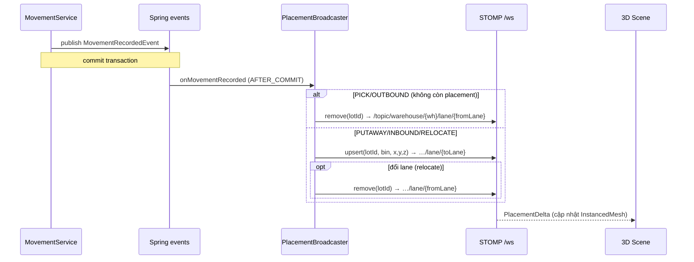
```mermaid
sequenceDiagram
    participant MS as MovementService
    participant EV as Spring events
    participant PB as PlacementBroadcaster
    participant WS as STOMP /ws
    participant FE as 3D Scene

    MS->>EV: publish MovementRecordedEvent
    Note over MS,EV: commit transaction
    EV->>PB: onMovementRecorded (AFTER_COMMIT)
    alt PICK/OUTBOUND (không còn placement)
        PB->>WS: remove(lotId) → /topic/warehouse/{wh}/lane/{fromLane}
    else PUTAWAY/INBOUND/RELOCATE
        PB->>WS: upsert(lotId, bin, x,y,z) → …/lane/{toLane}
        opt đổi lane (relocate)
            PB->>WS: remove(lotId) → …/lane/{fromLane}
        end
    end
    WS-->>FE: PlacementDelta (cập nhật InstancedMesh)
```

## 16. Flowchart — thuật toán CRP (Relocation) từng bước

Vòng lặp greedy: dời blocker trực tiếp ưu tiên nhất tới vị trí tạm, lặp đến khi lô
đích hết bị chặn.

```mermaid
flowchart TD
    A([plan lotId]) --> B{"placement của lot tồn tại?"}
    B -- không --> B404[/"404 NotFound"/]
    B -- có --> C["Load tất cả lô trong lane → List LotBox"]
    C --> D{"target còn blocker trực tiếp?"}
    D -- không --> E([Trả RelocationPlan steps])
    D -- có --> F["pickBlocker: chọn lô lấy-muộn-nhất,<br/>tie-break z cao nhất"]
    F --> G{"tìm vị trí tạm<br/>không tạo blocking mới?"}
    G -- không có --> G400[/"400 IllegalState"/]
    G -- có --> H["thêm step (lô, binCũ, dest)"]
    H --> I["mô phỏng dời lô in-memory"]
    I --> D
```

## 17. Flowchart — thuật toán SLAP (Putaway) chấm điểm

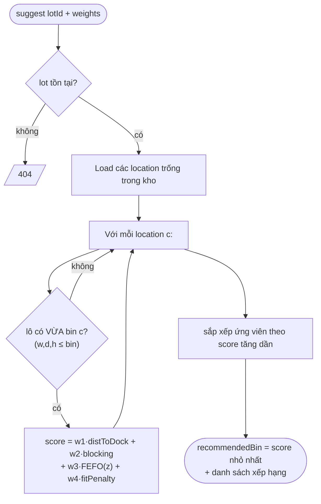
```mermaid
flowchart TD
    A([suggest lotId + weights]) --> B{"lot tồn tại?"}
    B -- không --> B404[/"404"/]
    B -- có --> C["Load các location trống trong kho"]
    C --> D["Với mỗi location c:"]
    D --> E{"lô có VỪA bin c?<br/>(w,d,h ≤ bin)"}
    E -- không --> D
    E -- có --> F["score = w1·distToDock + w2·blocking<br/>+ w3·FEFO(z) + w4·fitPenalty"]
    F --> D
    D --> G["sắp xếp ứng viên theo score tăng dần"]
    G --> H([recommendedBin = score nhỏ nhất<br/>+ danh sách xếp hạng])
```

## 18. ERD đầy đủ (mọi cột, Flyway V1–V6)

Phiên bản chi tiết hơn §2 — đủ cột + khóa, khớp [data-model.md](./data-model.md).
`V1` 5 bảng gốc · `V2` picking (pick_order/order_line) · `V3` multi-warehouse
(warehouse + warehouse_id) · `V4` require_scan · `V5` timezone · `V6` transfer.

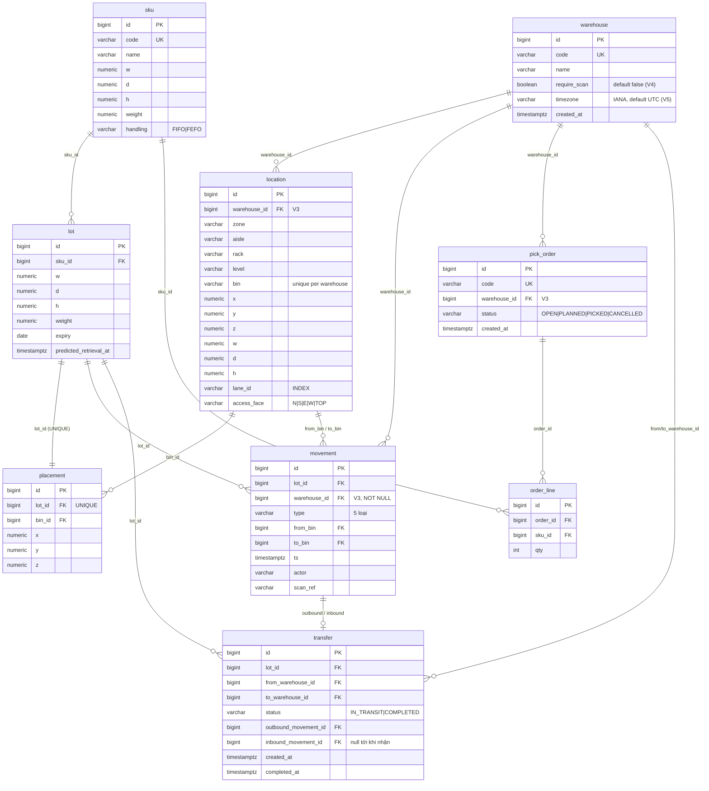
```mermaid
erDiagram
    warehouse ||--o{ location   : warehouse_id
    warehouse ||--o{ movement   : warehouse_id
    warehouse ||--o{ pick_order : warehouse_id
    warehouse ||--o{ transfer   : "from/to_warehouse_id"
    sku       ||--o{ lot        : sku_id
    sku       ||--o{ order_line : sku_id
    lot       ||--|| placement  : "lot_id (UNIQUE)"
    lot       ||--o{ movement   : lot_id
    lot       ||--o{ transfer   : lot_id
    location  ||--o{ placement  : bin_id
    location  ||--o{ movement   : "from_bin / to_bin"
    pick_order ||--o{ order_line : order_id
    movement  ||--o| transfer   : "outbound / inbound"

    warehouse {
        bigint id PK
        varchar code UK
        varchar name
        boolean require_scan "default false (V4)"
        varchar timezone "IANA, default UTC (V5)"
        timestamptz created_at
    }
    location {
        bigint id PK
        bigint warehouse_id FK "V3"
        varchar zone
        varchar aisle
        varchar rack
        varchar level
        varchar bin "unique per warehouse"
        numeric x
        numeric y
        numeric z
        numeric w
        numeric d
        numeric h
        varchar lane_id "INDEX"
        varchar access_face "N|S|E|W|TOP"
    }
    sku {
        bigint id PK
        varchar code UK
        varchar name
        numeric w
        numeric d
        numeric h
        numeric weight
        varchar handling "FIFO|FEFO"
    }
    lot {
        bigint id PK
        bigint sku_id FK
        numeric w
        numeric d
        numeric h
        numeric weight
        date expiry
        timestamptz predicted_retrieval_at
    }
    placement {
        bigint id PK
        bigint lot_id FK "UNIQUE"
        bigint bin_id FK
        numeric x
        numeric y
        numeric z
    }
    movement {
        bigint id PK
        bigint lot_id FK
        bigint warehouse_id FK "V3, NOT NULL"
        varchar type "5 loại"
        bigint from_bin FK
        bigint to_bin FK
        timestamptz ts
        varchar actor
        varchar scan_ref
    }
    pick_order {
        bigint id PK
        varchar code UK
        bigint warehouse_id FK "V3"
        varchar status "OPEN|PLANNED|PICKED|CANCELLED"
        timestamptz created_at
    }
    order_line {
        bigint id PK
        bigint order_id FK
        bigint sku_id FK
        int qty
    }
    transfer {
        bigint id PK
        bigint lot_id FK
        bigint from_warehouse_id FK
        bigint to_warehouse_id FK
        varchar status "IN_TRANSIT|COMPLETED"
        bigint outbound_movement_id FK
        bigint inbound_movement_id FK "null tới khi nhận"
        timestamptz created_at
        timestamptz completed_at
    }
```

---

### Ghi chú về file Astah
`diagrams/stockpile-3d.asta` chứa 4 package: `domain`, `service`, `erd`,
`architecture`. Khi mở bằng Astah bạn sẽ thấy một số class "kiểu dữ liệu"
(`Long`, `String`, `bigint`…) được sinh tự động do công cụ — bỏ qua khi vẽ
diagram. Quan hệ FK hiển thị dưới dạng association giữa các class. *(Lưu ý: file
Astah chưa cập nhật các entity multi-warehouse/picking/transfer; các sơ đồ Mermaid
ở trên là nguồn cập nhật nhất.)*
