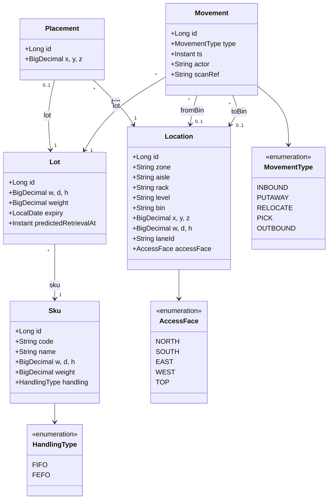
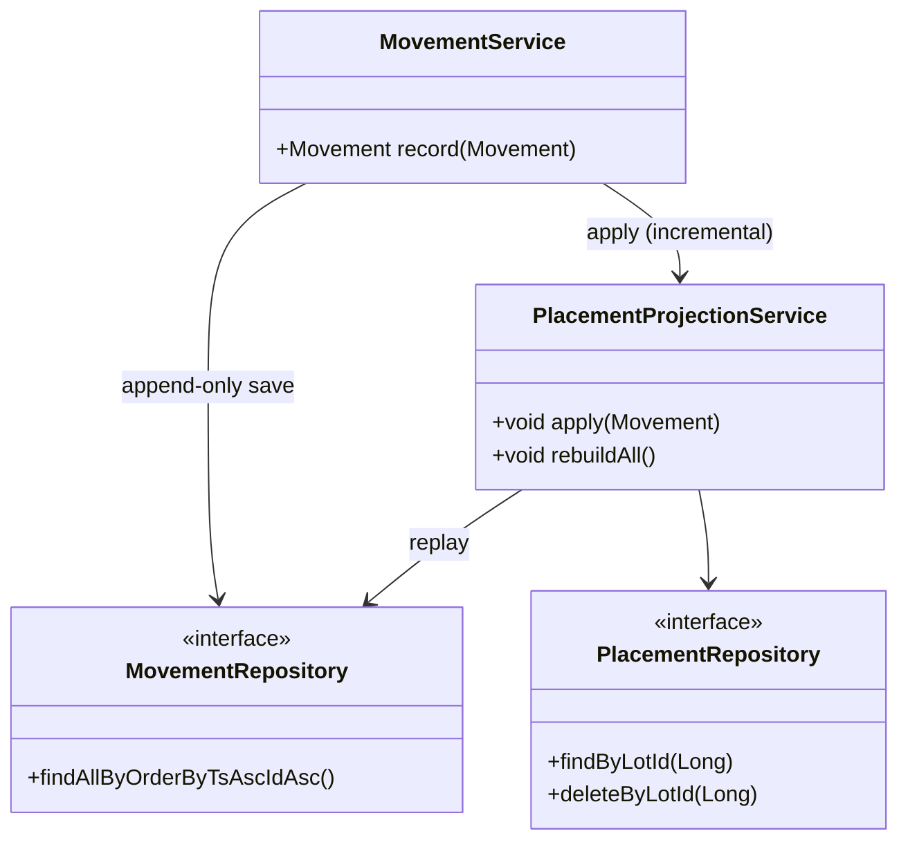
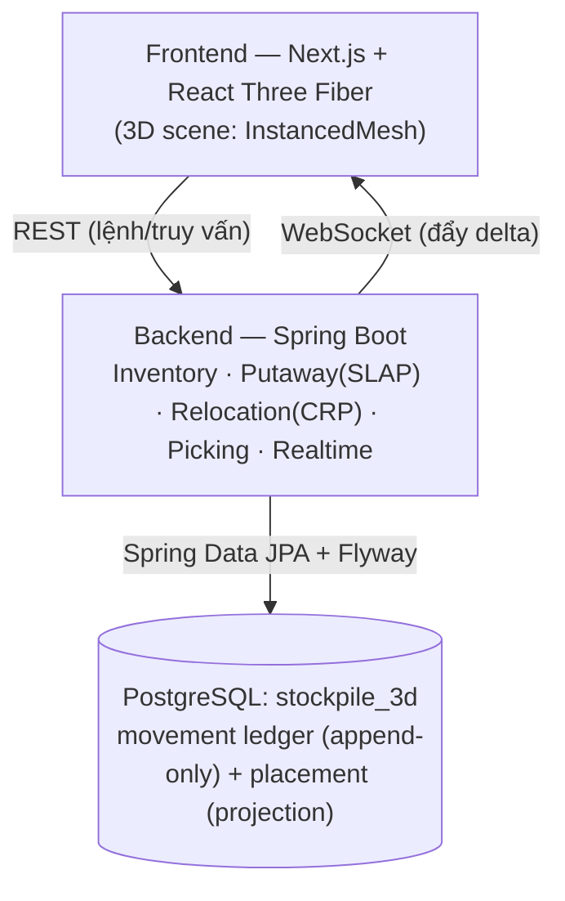
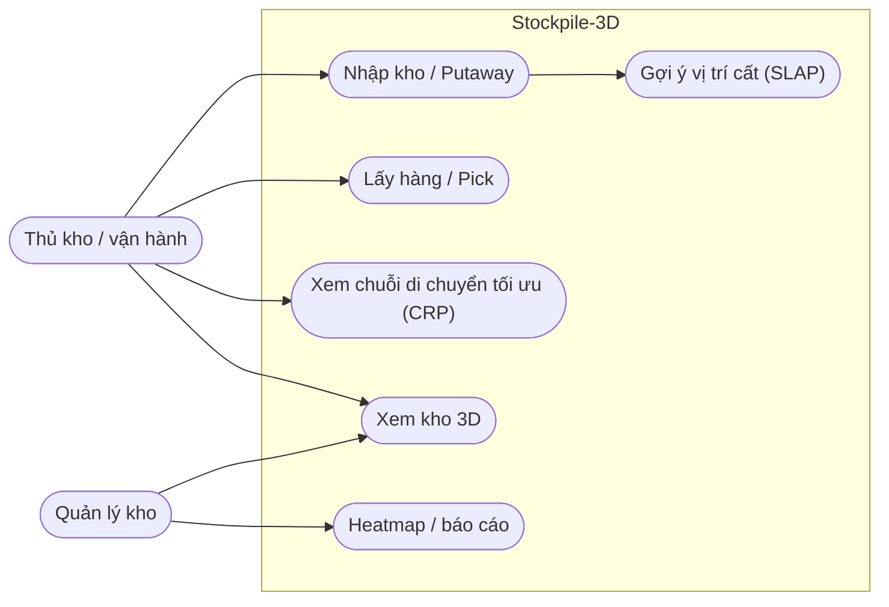
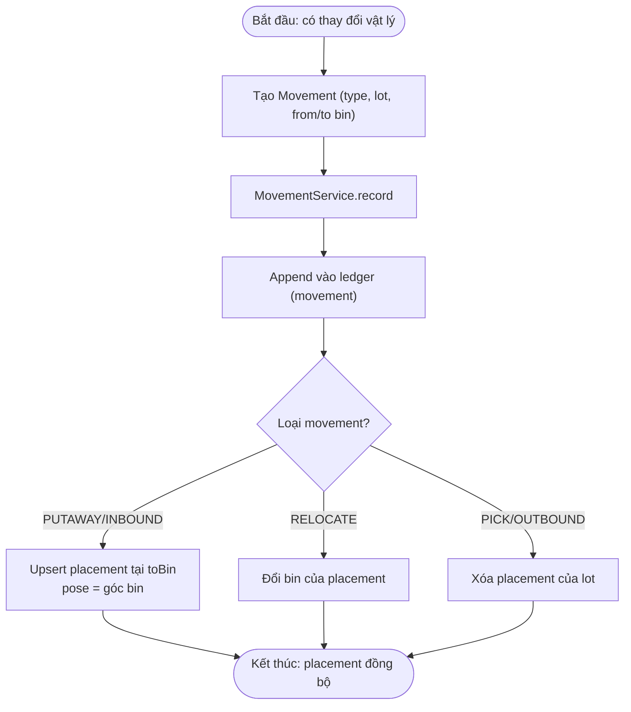
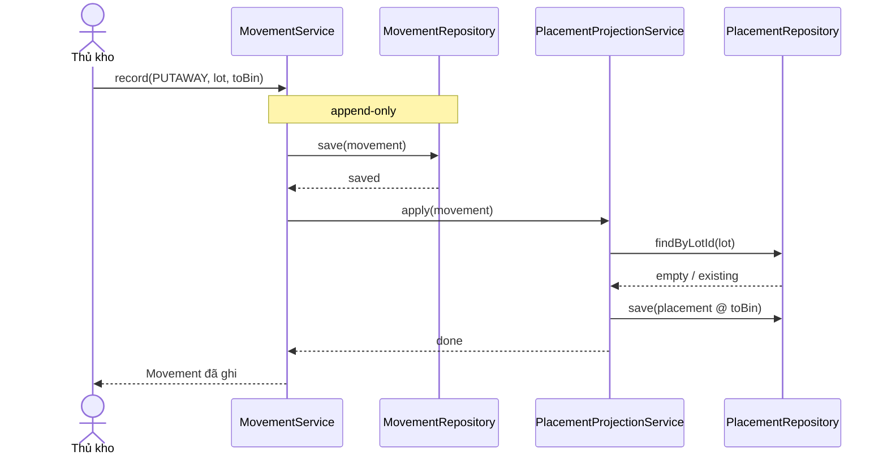
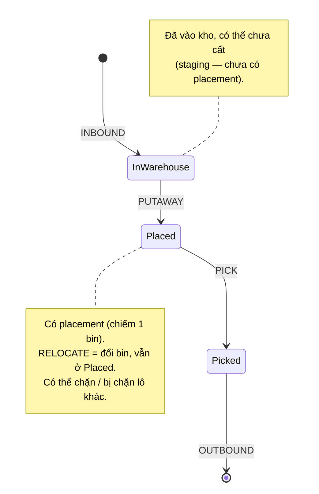
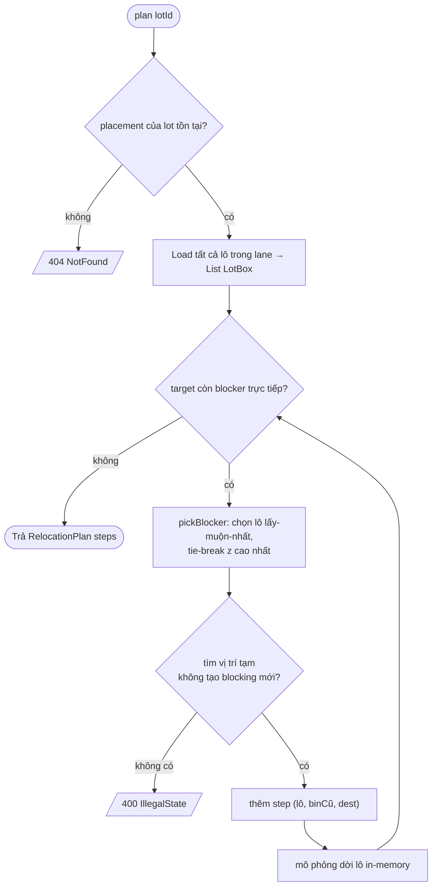
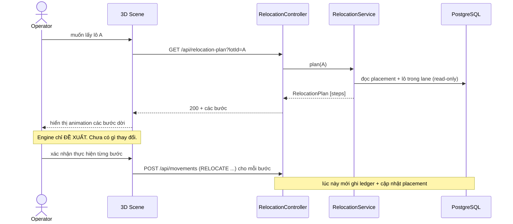
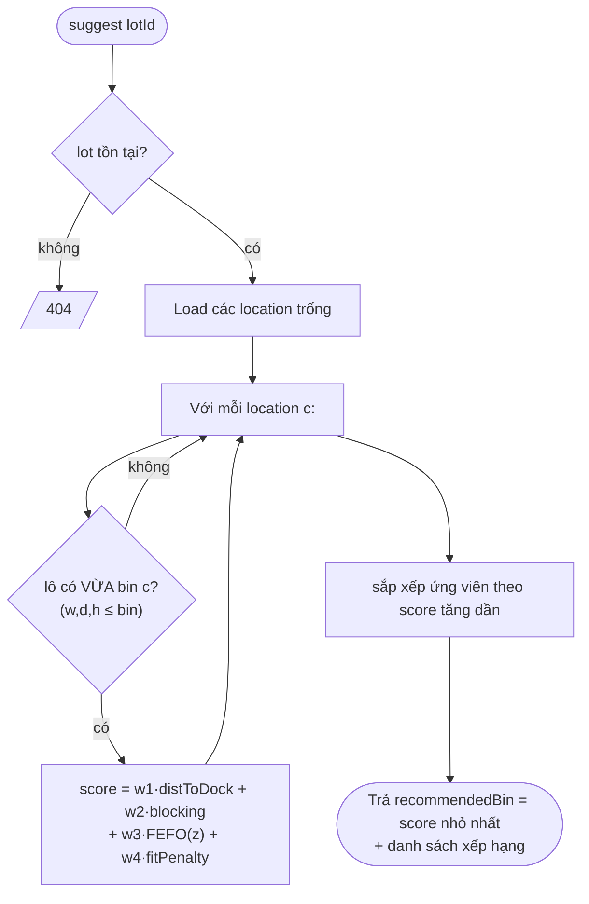

# Sơ đồ thiết kế — Stockpile-3D

> Sơ đồ trực quan (Mermaid — xem trực tiếp trên GitHub) cho data model, kiến trúc, và **2 thuật toán lõi**. Phần class/ERD/component có thêm mô hình Astah ở [`diagrams/stockpile-3d.asta`](./diagrams/stockpile-3d.asta) (mở bằng Astah để chỉnh/export ảnh).
>
> **Mục lục:**
> - Cấu trúc: §1 Class domain · §2 ERD gọn · §3 Class service · §4 Component
> - Nghiệp vụ: §5 Use case · §6 Activity · §7 Sequence (putaway) · §8 **State — vòng đời lô**
> - Thuật toán: §9 **Flowchart CRP** · §10 **Sequence CRP (đề xuất→xác nhận)** · §11 **Flowchart SLAP**
> - Tham chiếu: §12 **ERD đầy đủ cột**
>
> Nguồn sự thật về thiết kế: [01-overview.md](./01-overview.md) §6, [data-model.md](./data-model.md), [algorithm-spec.md](./algorithm-spec.md), [architecture.md](./architecture.md) và các [ADR](./adr/).

## 1. Class diagram — Domain (entities)

Phản ánh các entity trong `src/backend/.../inventory/domain`. `placement` là
projection từ ledger; `movement` là ledger append-only (xem [ADR-0003](./adr/0003-ledger-projection.md)).



## 2. ERD — bảng PostgreSQL (Flyway V1)

Khóa chính BIGINT identity; enum lưu VARCHAR + CHECK; `placement.lot_id` UNIQUE
(một lô chiếm tối đa một vị trí).

```mermaid
erDiagram
    location ||--o{ placement : "bin_id"
    location ||--o{ movement  : "from_bin / to_bin"
    sku      ||--o{ lot       : "sku_id"
    lot      ||--|| placement : "lot_id (UNIQUE)"
    lot      ||--o{ movement  : "lot_id"

    location {
        bigint id PK
        varchar zone
        varchar aisle
        varchar rack
        varchar level
        varchar bin
        numeric x_y_z
        numeric w_d_h
        varchar lane_id
        varchar access_face
    }
    sku {
        bigint id PK
        varchar code UK
        varchar name
        numeric w_d_h
        numeric weight
        varchar handling
    }
    lot {
        bigint id PK
        bigint sku_id FK
        numeric w_d_h
        numeric weight
        date expiry
        timestamptz predicted_retrieval_at
    }
    placement {
        bigint id PK
        bigint lot_id FK_UK
        bigint bin_id FK
        numeric x_y_z
    }
    movement {
        bigint id PK
        bigint lot_id FK
        varchar type
        bigint from_bin FK
        bigint to_bin FK
        timestamptz ts
        varchar actor
        varchar scan_ref
    }
```

## 3. Class diagram — Service (ledger → projection)

Một quy tắc `apply()` dùng chung cho cả ghi incremental lẫn `rebuildAll()` replay,
nên hai con đường không thể lệch nhau. *(Thuộc PR `feature/ledger-projection`.)*



## 4. Component / kiến trúc tổng thể



## 5. Use case — vai trò & chức năng



## 6. Activity — ghi một movement + cập nhật projection



## 7. Sequence — luồng Putaway (incremental projection)



## 8. State diagram — vòng đời một lô (lot lifecycle)

Lô đi qua các trạng thái theo loại movement. CRP/SLAP làm việc ở trạng thái `Placed`.



## 9. Flowchart — thuật toán CRP (Relocation) từng bước

Vòng lặp greedy: dời blocker trực tiếp ưu tiên nhất tới vị trí tạm, lặp đến khi lô đích hết bị chặn.



## 10. Sequence — CRP đề xuất rồi người dùng xác nhận (luồng đầy đủ)

Thể hiện tách bạch "đề xuất" (chỉ đọc) và "thực thi" (người dùng xác nhận → ghi ledger).



## 11. Flowchart — thuật toán SLAP (Putaway) chấm điểm



## 12. ERD đầy đủ (mọi cột)

Phiên bản chi tiết hơn §2 — đủ cột + khóa, khớp [data-model.md](./data-model.md) và Flyway `V1`.

```mermaid
erDiagram
    sku ||--o{ lot : sku_id
    lot ||--|| placement : "lot_id (UNIQUE)"
    lot ||--o{ movement : lot_id
    location ||--o{ placement : bin_id
    location ||--o{ movement : "from_bin / to_bin"

    sku {
        bigint id PK
        varchar code UK
        varchar name
        numeric w
        numeric d
        numeric h
        numeric weight
        varchar handling "FIFO|FEFO"
    }
    location {
        bigint id PK
        varchar zone
        varchar aisle
        varchar rack
        varchar level
        varchar bin
        numeric x
        numeric y
        numeric z
        numeric w
        numeric d
        numeric h
        varchar lane_id "INDEX"
        varchar access_face "N|S|E|W|TOP"
    }
    lot {
        bigint id PK
        bigint sku_id FK
        numeric w
        numeric d
        numeric h
        numeric weight
        date expiry
        timestamptz predicted_retrieval_at
    }
    placement {
        bigint id PK
        bigint lot_id FK_UK
        bigint bin_id FK
        numeric x
        numeric y
        numeric z
    }
    movement {
        bigint id PK
        bigint lot_id FK
        varchar type "5 loại"
        bigint from_bin FK
        bigint to_bin FK
        timestamptz ts
        varchar actor
        varchar scan_ref
    }
```

---

### Ghi chú về file Astah
`diagrams/stockpile-3d.asta` chứa 4 package: `domain`, `service`, `erd`,
`architecture`. Khi mở bằng Astah bạn sẽ thấy một số class "kiểu dữ liệu"
(`Long`, `String`, `bigint`…) được sinh tự động do công cụ — bỏ qua khi vẽ
diagram. Quan hệ FK hiển thị dưới dạng association giữa các class.
