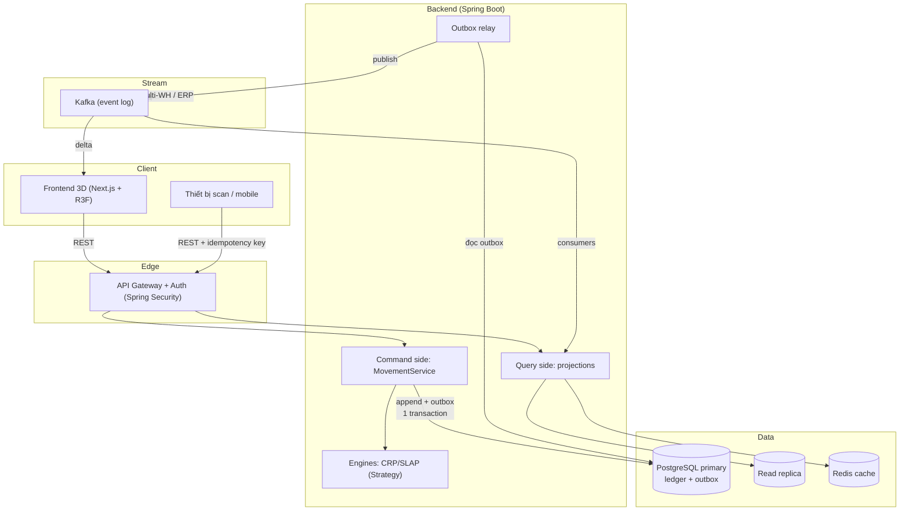

# Đề xuất thiết kế hệ thống — hướng tới production quy mô lớn

> **Tài liệu đề xuất (forward-looking).** Phân tích hiện trạng rồi đề xuất công nghệ + mẫu thiết kế (design pattern) giúp Stockpile-3D mạnh mẽ, mở rộng và tin cậy hơn ở quy mô production lớn (nhiều kho, hàng chục nghìn vị trí, nhiều người dùng đồng thời).
>
> **Tính chất:** đây là *đề xuất để tham khảo/thảo luận*, **không phải** quyết định đã chốt. Quyết định thật phải thành [ADR](./adr/) riêng. Tài liệu cũng trung thực về **trade-off** và đánh dấu **mức ưu tiên** (Now / Next / Later) để tránh over-engineering (làm quá mức cần thiết). Đọc cùng [architecture.md](./architecture.md) (hiện trạng) và [01-overview.md](./01-overview.md).

---

## 📖 Nói nôm na (đọc cái này trước)

Hệ thống hiện tại chạy tốt cho **một kho cỡ vừa**. Tài liệu này hỏi: *"nếu muốn chạy cho nhiều kho lớn, nhiều người dùng cùng lúc, không bao giờ sai dữ liệu — thì cần thêm gì?"*.

Trả lời theo 4 hướng:
1. **Nhanh & lớn hơn** (scale) — thêm bộ nhớ đệm, tối ưu truy vấn, tách đọc/ghi.
2. **Không bao giờ sai** (tin cậy) — khóa chống tranh chấp, đảm bảo "ghi đúng một lần".
3. **Thời gian thực** (realtime) — đẩy thay đổi tới màn hình tức thì, dùng hàng đợi sự kiện.
4. **Code sạch & dễ vận hành** — mẫu thiết kế tốt, giám sát, kiểm thử, bảo mật.

Mỗi đề xuất đều ghi: *cần khi nào* (Now/Next/Later) và *được gì / mất gì*.

---

## 1. Hiện trạng (điểm mạnh đã có)

Trước khi đề xuất thêm, ghi nhận nền đã tốt:

- ✅ **Event-sourcing-lite:** `movement` ledger append-only là nguồn sự thật, `placement` là projection ([ADR-0003](./adr/0003-ledger-projection.md)). Đây là nền **rất mạnh** để mở rộng — nhiều đề xuất bên dưới dựa vào nó.
- ✅ **Tách tầng rõ:** controller → service → repository; thuật toán thuần (`BlockingGraph`) tách khỏi JPA → dễ test, dễ thay.
- ✅ **Blocking cục bộ theo lane** — giới hạn phạm vi tính toán, tránh bài toán không gian toàn cục.
- ✅ **Migration versioned (Flyway), test thật (Testcontainers), Docker hóa** — nền vận hành tốt.

> Điều này nghĩa là phần lớn đề xuất dưới đây là **tiến hóa**, không phải đập đi xây lại.

---

## 2. Hướng A — Hiệu năng & Mở rộng (Scale)

### A1. Tách đọc/ghi triệt để — CQRS đầy đủ `[Next]`
**Hiện trạng:** đã có mầm CQRS (lệnh ghi qua `MovementService`, đọc qua projection `placement`). 

**Đề xuất:** tách rõ **Command side** (ghi ledger) và **Query side** (nhiều projection chuyên biệt cho từng nhu cầu đọc). Ví dụ: ngoài `placement`, thêm projection `lane_occupancy` (mật độ theo lane cho heatmap), `sku_stock` (tồn kho theo SKU) — mỗi cái tối ưu cho một loại query.

**Pattern:** CQRS (Command Query Responsibility Segregation — tách trách nhiệm lệnh/truy vấn).
**Được:** mỗi query cực nhanh (đọc bảng đã tính sẵn); scale đọc độc lập với ghi.
**Mất:** nhiều projection phải maintain; phức tạp hơn. **Chỉ làm khi** số loại query + tải đọc tăng cao.

### A2. Caching tầng đọc — Redis `[Next]`
**Đề xuất:** Redis (in-memory cache) cache các truy vấn nóng: trạng thái lane (cho 3D scene), kết quả `relocation-plan`/`putaway-suggestion` (đắt để tính lại).
**Pattern:** Cache-Aside (đọc cache trước, miss thì đọc DB rồi nạp cache); invalidate khi có movement liên quan lane đó.
**Được:** giảm tải DB, đáp ứng nhanh. **Mất:** rủi ro cache lệch (stale) — phải invalidate đúng. Vì ledger là nguồn sự thật, có thể dùng **event** (mục C) để invalidate chính xác.

### A3. Index không gian cho blocking ở quy mô lớn — PostGIS / GiST `[Later]`
**Hiện trạng:** ADR-0002 cố ý **chưa** dùng PostGIS — blocking suy luận trong lane (vài chục lô) là đủ.
**Đề xuất (khi multi-warehouse / lane rất lớn):** dùng **PostGIS** (extension không gian của Postgres) với **GiST index** (Generalized Search Tree — index cho dữ liệu không gian/đa chiều) để truy vấn "lô nào giao nhau trong không gian 3D" nhanh hơn quét tuyến tính.
**Được:** truy vấn blocking từ `O(n)` quét lane xuống gần `O(log n)`; hỗ trợ truy vấn không gian phức tạp.
**Mất:** thêm dependency nặng, phức tạp vận hành. **Chỉ khi** quy mô vượt giả định "kho vừa". *(Đây là nâng cấp đã được dự kiến trong ADR-0002.)*

### A4. Read replica + phân trang/streaming `[Later]`
- **Read replica** (bản sao chỉ-đọc của Postgres): định tuyến query đọc (3D, báo cáo) sang replica, ghi vào primary → scale đọc.
- **Phân trang (pagination) + cursor**: API list (`/api/locations`, `/api/placements`) hiện trả tất cả — ở 50k vị trí phải phân trang hoặc stream để frontend không nghẽn.
- **InstancedMesh + LOD + virtualization** ở frontend: chỉ render vùng camera thấy (đã có frustum culling), thêm Level-of-Detail cho vật xa.

### A5. Tối ưu thuật toán `[Next]`
- CRP hiện `O(n²)` mỗi lane — dựng blocking graph một lần `O(n log n)` (sắp theo z) thay vì kiểm cặp `O(n²)` (đã ghi hướng trong [algorithm-spec §6](./algorithm-spec.md)).
- Cân nhắc **beam search / branch-and-bound** khi cần lời giải gần tối ưu hơn greedy (ADR-0001 đã nêu).

---

## 3. Hướng B — Độ tin cậy & Nhất quán (Reliability)

### B1. Optimistic locking trên `placement`/`bin` — chống 2 putaway cùng chỗ `[Now]`
**Vấn đề thật:** 2 người cùng lúc cất 2 lô vào **cùng một bin** → ghi đè nhau, dữ liệu sai. NFR §7 đã nêu "optimistic lock trên bin".

**Đề xuất:** thêm cột `@Version` (JPA optimistic locking) vào `placement` (và/hoặc entity giữ chỗ bin). Khi 2 transaction cùng sửa, transaction thứ 2 nhận `OptimisticLockException` → retry hoặc báo lỗi "vị trí vừa bị chiếm".

**Vì sao optimistic, không pessimistic:** kho là ứng dụng **read-heavy + xung đột hiếm** (2 người cất đúng 1 ô cùng giây là hiếm). Optimistic không khóa DB, không deadlock, hiệu năng tốt hơn — đúng khuyến nghị cho ca này ([Baeldung](https://www.baeldung.com/jpa-optimistic-locking), [CodeWiz](https://codewiz.info/blog/locking-strategies-spring-boot/)). Pessimistic lock chỉ nên dùng nếu xung đột thường xuyên ([Medium — Prankur Garg](https://medium.com/@ramjasprankur/optimistic-vs-pessimistic-locking-in-a-spring-boot-application-cd11b48fe1bb)).
**Trade-off:** phải xử lý `OptimisticLockException` (retry/thông báo) ở tầng service. Đáng làm sớm — đây là lỗ hổng nhất quán hiện tại.

### B2. Idempotency cho ghi movement `[Next]`
**Vấn đề:** scan/bấm 2 lần, hoặc client retry do mạng → ghi trùng 1 movement.
**Đề xuất:** mỗi movement mang **idempotency key** (vd `scan_ref` + client request id, UNIQUE). Ghi trùng key → bỏ qua (no-op) thay vì tạo bản ghi mới.
**Được:** "ghi đúng một lần" kể cả khi retry. Quan trọng cho realtime/mobile scan (mạng chập chờn).

### B3. Transactional Outbox — phát sự kiện tin cậy `[Next]`
**Vấn đề khi thêm message queue (mục C):** ghi DB *và* publish event ra Kafka là 2 hệ thống — một cái fail thì lệch.
**Đề xuất:** **Outbox pattern** — ghi event vào một bảng `outbox` *trong cùng transaction* với movement; một tiến trình riêng đọc outbox và publish ra queue. Đảm bảo "ghi ledger ⇔ phát event" nguyên tử.
**Được:** không mất/không nhân đôi event. **Mất:** thêm bảng + tiến trình relay. Cần khi đã có message queue.

### B4. Event Sourcing chuẩn hóa `[Later]`
Hiện là "event-sourcing-lite". Nâng lên chuẩn: lưu event có schema phiên bản, snapshot định kỳ (tránh replay toàn bộ ledger khi rebuild projection), event versioning. **Chỉ khi** ledger rất lớn (rebuild chậm).

### B5. Resilience patterns `[Later]`
Khi gọi service ngoài (vd thiết bị scan, hệ thống ERP): **retry với backoff**, **circuit breaker** (Resilience4j) chống lan truyền lỗi, **timeout** rõ ràng.

---

## 4. Hướng C — Realtime & Sự kiện (Event-driven) — gắn Phase 3

### C1. WebSocket đẩy delta tới 3D scene `[Now — Phase 3]`
**Đề xuất:** Spring WebSocket: khi `placement` đổi (sau mỗi movement), đẩy **delta** (chỉ phần thay đổi) tới các client đang xem lane đó → 3D scene cập nhật tức thì, không cần reload. NFR: < 1s scan→scene.
**Pattern:** Publish-Subscribe theo "topic" = lane/zone (client chỉ nhận delta vùng mình xem).
**Lưu ý:** dùng **STOMP** trên WebSocket (Spring hỗ trợ sẵn) cho cấu trúc topic; hoặc **SSE** (Server-Sent Events) nếu chỉ cần một chiều server→client (đơn giản hơn WebSocket).

### C2. Domain Events nội bộ `[Next]`
**Đề xuất:** khi ghi movement, phát **domain event** (`LotMoved`, `BinOccupied`) qua Spring `ApplicationEventPublisher`. Các listener xử lý độc lập: cập nhật projection, invalidate cache (A2), đẩy WebSocket (C1), ghi audit.
**Pattern:** Domain Events + Observer. **Được:** tách rời (decoupling) — thêm hành vi mới chỉ cần thêm listener, không sửa `MovementService`.

### C3. Message Queue — Kafka / RabbitMQ `[Later]`
**Khi nào cần:** nhiều consumer cần stream ledger (analytics, ML dự đoán retrieval, đồng bộ multi-warehouse, tích hợp ERP).
**Đề xuất:** **Kafka** nếu cần *event log bền + replay + throughput cao* (rất hợp triết lý ledger của dự án — ledger ↔ Kafka topic là ánh xạ tự nhiên). **RabbitMQ** nếu chỉ cần hàng đợi tác vụ đơn giản.
**Trade-off:** Kafka mạnh nhưng nặng vận hành (ZooKeeper/KRaft, ops). **Chỉ khi** thật sự có nhiều consumer / multi-warehouse. Kết hợp **Outbox (B3)** để publish tin cậy.

---

## 5. Hướng D — Chất lượng code & Vận hành

### D1. Strategy pattern cho thuật toán `[Now — rẻ, giá trị cao]`
**Đề xuất:** định nghĩa interface `RelocationStrategy` (và `PutawayScorer`); hiện thực `GreedyRelocationStrategy` là mặc định. Sau này thêm `BeamSearchStrategy` chỉ cần cắm vào, chọn qua config.
**Pattern:** Strategy (đóng gói thuật toán có thể hoán đổi). **Được:** ADR-0001 nói "sẽ đánh giá lại beam search" — Strategy làm việc đó *không phải sửa code gọi*. Rẻ, nên làm sớm.

### D2. Hexagonal Architecture (Ports & Adapters) `[Next]`
**Đề xuất:** tách **domain/thuật toán lõi** (CRP, SLAP, projection) khỏi **hạ tầng** (JPA, REST, WebSocket) qua interface (port). DB/web chỉ là adapter cắm vào.
**Pattern:** Hexagonal / Ports-Adapters. **Được:** lõi giá trị (thuật toán) test được không cần Spring/DB; đổi hạ tầng (vd Postgres→khác) không đụng lõi. Dự án đã đi đúng hướng (BlockingGraph thuần) — đây là hệ thống hóa nó.

### D3. Observability — logs/metrics/tracing `[Next]`
- **Structured logging** (JSON) + correlation id theo request.
- **Metrics** (Micrometer + Prometheus): thời gian tính CRP/lane, tỉ lệ cache hit, số movement/giây — đo NFR thật.
- **Distributed tracing** (OpenTelemetry): lần theo 1 request qua các tầng. Cần khi có nhiều service.

### D4. Testing nâng cao `[Next]`
- **Property-based testing** cho thuật toán (vd: với mọi cấu hình lane ngẫu nhiên, plan CRP luôn làm lô đích hết bị chặn) — bắt edge case mà test ví dụ bỏ sót (đúng tinh thần bug `>` vs `>=` trong dev-log).
- **Performance test** kiểm NFR (<500ms CRP/lane) tự động trong CI.

### D5. CI/CD & Security `[Now/Next]`
- **CI** (GitHub Actions): chạy `mvnw test` (Testcontainers cần Docker — runner GitHub có sẵn) + build mỗi PR. `[Now]`
- **Security:** thêm **Spring Security** + xác thực (JWT/OAuth2) khi có nhiều người dùng/vai trò (operator vs manager — đã định nghĩa trong [business.md](./business.md)). Rate limiting, input validation (đã có Bean Validation). `[Next]`
- **Secrets management:** hiện dùng env var (tốt); production dùng vault (HashiCorp Vault / cloud secret manager). `[Later]`

---

## 6. Sơ đồ — kiến trúc đề xuất (mục tiêu, không phải hiện tại)

> So với [architecture.md](./architecture.md) (hiện tại: FE ↔ Spring Boot ↔ Postgres), sơ đồ này thêm: Gateway/Auth, tách Command/Query, Redis, read replica, Outbox, Kafka. **Không cần làm hết** — xem ưu tiên §7.

---

## 7. Ưu tiên đề xuất (lộ trình thực tế)

> Trung thực: dự án định vị "kho vừa". Phần lớn mục `[Later]` chỉ đáng làm khi **thật sự** chạm giới hạn — làm sớm là over-engineering. Bảng này giúp phân biệt.

| Ưu tiên | Đề xuất | Vì sao |
|---|---|---|
| **Now** (nên làm sớm, rẻ, giá trị cao) | B1 optimistic lock · C1 WebSocket (Phase 3) · D1 Strategy · D5 CI | Vá lỗ hổng nhất quán + đúng roadmap + rẻ |
| **Next** (khi tải/tính năng tăng) | A1 CQRS · A2 Redis · A5 tối ưu CRP · B2 idempotency · B3 outbox · C2 domain events · D2 hexagonal · D3 observability · D4 testing nâng cao · D5 security | Mở rộng + tin cậy khi có người dùng thật |
| **Later** (chỉ khi scale rất lớn / multi-warehouse) | A3 PostGIS · A4 read replica · B4 event sourcing chuẩn · B5 resilience · C3 Kafka | Nặng vận hành; chỉ đáng khi vượt "kho vừa" |

## 8. Nguyên tắc khi áp dụng

1. **Mỗi quyết định lớn → 1 ADR** (status `Proposed` → `Accepted`). Tài liệu này chỉ *gợi ý*.
2. **Đo trước khi tối ưu** — thêm observability (D3) để biết nút thắt thật, đừng đoán.
3. **Giữ invariant lõi** — ledger là nguồn sự thật; mọi đề xuất phải tôn trọng nó (thực ra đa số *dựa vào* nó).
4. **Tránh over-engineering** — kho vừa không cần Kafka/K8s; làm `[Now]` + `[Next]` cho chắc trước.

---

## 9. Tham khảo
- Optimistic vs Pessimistic Locking: [Baeldung](https://www.baeldung.com/jpa-optimistic-locking) · [CodeWiz](https://codewiz.info/blog/locking-strategies-spring-boot/) · [Medium — Prankur Garg](https://medium.com/@ramjasprankur/optimistic-vs-pessimistic-locking-in-a-spring-boot-application-cd11b48fe1bb)
- Liên quan nội bộ: [architecture.md](./architecture.md) · [algorithm-spec.md](./algorithm-spec.md) · [ADR-0002](./adr/0002-backend-spring-boot.md) · [ADR-0003](./adr/0003-ledger-projection.md) · [glossary.md](./glossary.md)
